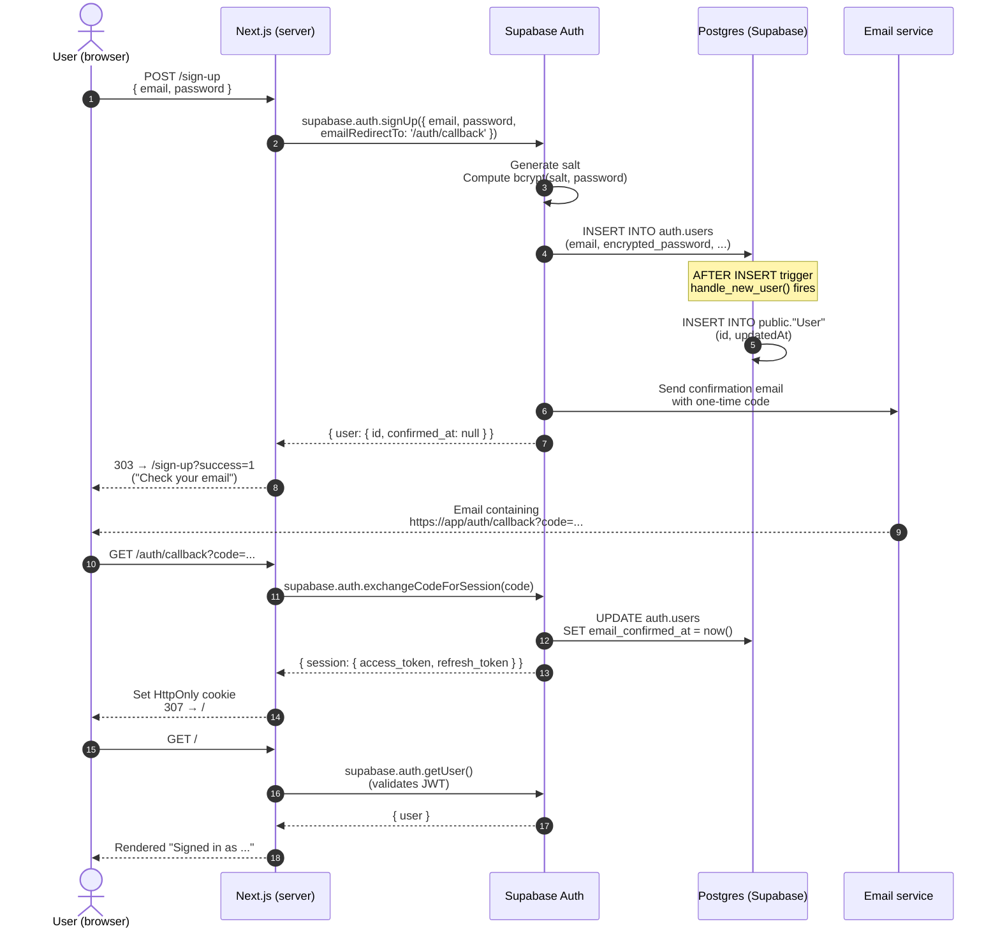
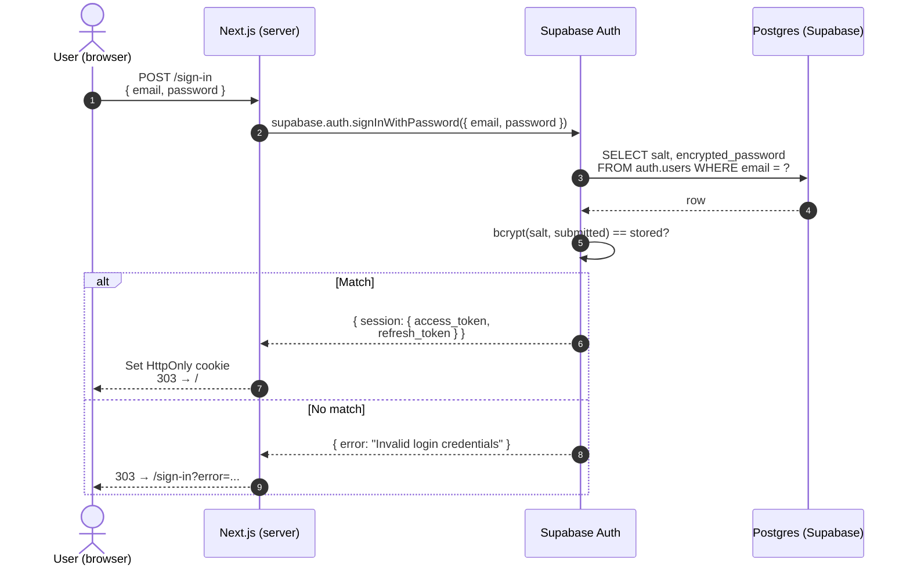
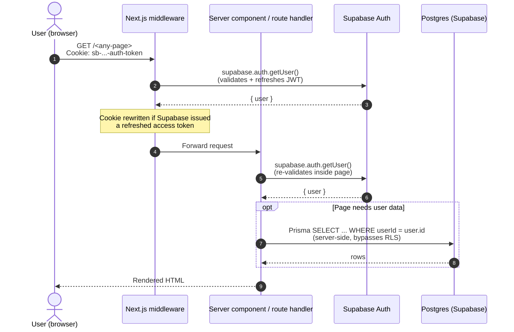
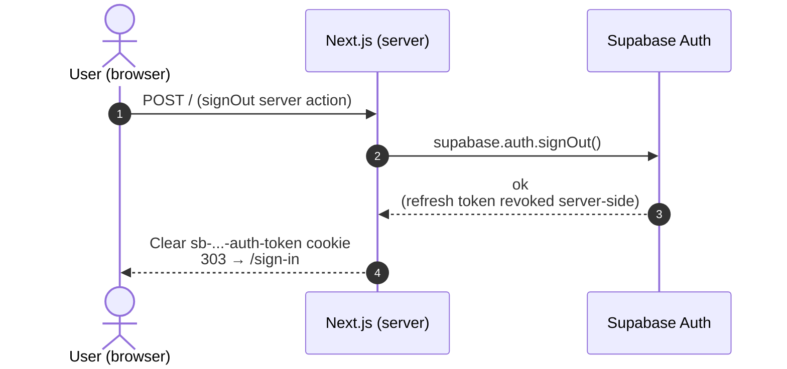
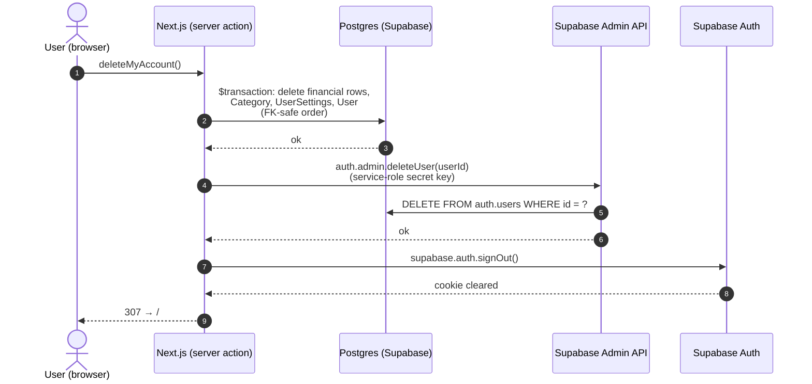

# Authentication Flow

This document explains *what kind* of authentication Halcyon uses, where each piece of state lives, and what happens on the wire during sign-up, sign-in, and sign-out.

See also: [ADR-001 (Tech Stack)](ADRs/ADR-001-TechStackSelection.md), [ADR-002 (Security)](ADRs/ADR-002-SecurityArchitecture.md), [Data Models](DataModels/DataModels.md).

## What kind of auth is this?

**Email/password + OAuth (planned) via [Supabase Auth](https://supabase.com/docs/guides/auth)**, integrated into Next.js using the [`@supabase/ssr`](https://supabase.com/docs/guides/auth/server-side/nextjs) helpers.

The pattern is the **"identity-in-`auth`, profile-in-`public`"** pattern — the canonical way to use Supabase Auth from a relational app. Three concrete consequences:

1. **Identity rows live in `auth.users`**, a table inside the `auth` schema that Supabase owns and that you never write migrations against. It holds the email, the bcrypt-hashed password (`encrypted_password`), the confirmation timestamp, OAuth provider identities, MFA factors, etc.
2. **Profile rows live in `public.User`**, which *we* own. It's keyed 1:1 to `auth.users.id` by `uuid`. It holds app-specific fields (timezone, display name, status, lastActiveAt) that don't belong in Supabase's table.
3. **A Postgres trigger keeps the two in sync.** `on_auth_user_created` fires `AFTER INSERT ON auth.users` and inserts a matching row into `public."User"`. This means a profile row is always created in the same transaction as the auth row — no race conditions, no orphan auth users.

### Why this is best-practice

| Concern | How this pattern handles it |
|---|---|
| Password storage | Supabase Auth uses bcrypt (or Argon2 depending on config) with a unique per-user salt, stored only in `auth.users.encrypted_password`. The application never sees the plaintext or the hash. |
| Session management | Supabase issues a signed JWT after sign-in. `@supabase/ssr` stores it as an `HttpOnly`, `Secure`, `SameSite=Lax` cookie, so client-side JavaScript cannot read it (mitigates XSS-based session theft). |
| Email verification, password reset, OAuth callbacks | All handled by Supabase Auth endpoints. The app only implements a single `/auth/callback` route handler that exchanges a one-time code for a session. |
| Brute force / credential stuffing | Supabase rate-limits its own auth endpoints. Tunable in the Supabase dashboard. The application has no own lockout counters to maintain. |
| Authorisation | Two layers: app-level `userId` filtering on every Prisma query (primary boundary, because server-side Prisma bypasses RLS), **plus** Postgres Row Level Security with `auth.uid() = id` policies (defence-in-depth; the real fence if/when a feature ever queries Supabase directly from the browser). |
| Loss of secrets | The DB password and `SUPABASE_SECRET_KEY` are the only secrets that bypass RLS. They live in Vercel project env vars in production and `.env.local` in dev — never in source. |

## Components involved

| Component | Lives in | Role |
|---|---|---|
| **Browser** | User's machine | Submits forms; holds the session cookie. |
| **Next.js middleware** (`src/middleware.ts`) | Vercel edge / local Node | Runs on every request. Calls `supabase.auth.getUser()` to refresh the session cookie. |
| **Server components / route handlers** (`src/app/**`) | Vercel functions / local Node | Render pages and handle form POSTs. Use the server-side Supabase client (`src/lib/supabase/server.ts`). |
| **Supabase Auth** | `<project>.supabase.co` | Hashes passwords, issues JWTs, sends emails, validates OAuth, owns `auth.users`. |
| **Postgres** | Inside Supabase, same project | Stores `auth.users` (Supabase-managed) and `public."User"` (ours). Hosts the `on_auth_user_created` trigger that bridges the two. |
| **Email provider** | Wired up by Supabase | Sends confirmation / password-reset emails. Templates are configured in the Supabase dashboard. |

## Sequence diagrams

### Sign-up



### Sign-in (returning user)



### Authenticated request



### Sign-out



## Code map

| Concern | File |
|---|---|
| Browser-side Supabase client | [`src/lib/supabase/client.ts`](../src/lib/supabase/client.ts) |
| Server-side Supabase client (cookies via `next/headers`) | [`src/lib/supabase/server.ts`](../src/lib/supabase/server.ts) |
| Middleware Supabase client + session refresh helper | [`src/lib/supabase/middleware.ts`](../src/lib/supabase/middleware.ts) |
| Next.js middleware entry point | [`src/middleware.ts`](../src/middleware.ts) |
| Sign-in page + server action | [`src/app/sign-in/`](../src/app/sign-in/) |
| Sign-up page + server action | [`src/app/sign-up/`](../src/app/sign-up/) |
| OAuth / magic-link / email-confirmation callback | [`src/app/auth/callback/route.ts`](../src/app/auth/callback/route.ts) |
| Sign-out server action | [`src/app/actions.ts`](../src/app/actions.ts) |
| Profile-row trigger + RLS policies | [`prisma/migrations/20260522130000_supabase_auth_integration/migration.sql`](../prisma/migrations/20260522130000_supabase_auth_integration/migration.sql) |
| Account-data server actions (export / clear / delete) | [`src/app/settings/dataActions.ts`](../src/app/settings/dataActions.ts) |
| Service-role admin client (account erasure) | [`src/lib/supabase/admin.ts`](../src/lib/supabase/admin.ts) |

## Google OAuth setup

The "Continue with Google" button on `/sign-in` and `/sign-up` calls `supabase.auth.signInWithOAuth({ provider: 'google' })`, which redirects the browser to Google's consent screen, which redirects back to Supabase, which redirects back to our `/auth/callback` with a one-time `code`. The existing callback handler exchanges it for a session — same code path as email confirmation.

For the button to actually work, two pieces of configuration are required outside the codebase:

### 1. Google Cloud Console

1. Open [Google Cloud Console → APIs & Services → Credentials](https://console.cloud.google.com/apis/credentials).
2. Create a project (or reuse an existing one).
3. **OAuth consent screen** — fill in the basic fields (app name, support email, scopes: `openid`, `email`, `profile`). Add yourself as a test user while the screen is in "testing" mode.
4. **Credentials → Create Credentials → OAuth client ID** → Application type: **Web application**.
5. **Authorised redirect URIs** — add Supabase's callback URL:
   `https://<your-project-ref>.supabase.co/auth/v1/callback`
6. Save. Copy the **Client ID** and **Client Secret**.

### 2. Supabase Dashboard

1. Open your project → **Authentication → Providers**.
2. Find **Google** → toggle it on.
3. Paste the Client ID and Client Secret from step 1. Save.

### 3. Redirect URLs

Supabase needs to know which post-auth URLs are allowed to receive the session. **Authentication → URL Configuration**:

- **Site URL**: `http://localhost:3000` for dev; change to your Vercel URL for prod.
- **Redirect URLs**: add both `http://localhost:3000/auth/callback` and your production `https://<vercel-app>/auth/callback`.

Once those are in place, the button works without any further code changes.

## E2E test coverage

[`e2e/auth.spec.ts`](../e2e/auth.spec.ts) covers:

- Unauth state: home shows sign-in link; `/dashboard` redirects to `/sign-in?next=/dashboard`.
- Sign-up: zod rejects invalid email + short password (both server-side errors via redirect); happy path shows the "check your email" message.
- Sign-in: happy path; wrong password shows error; `?next=` returns to original target after sign-in.
- Sign-out: cookie clears; `/dashboard` becomes inaccessible again.
- Google button: present on both sign-in and sign-up pages (the real OAuth round-trip is not E2E-tested — would require a fake Google).

Tests run against a **mock Supabase Auth server** at [`e2e/_mock/supabase.mjs`](../e2e/_mock/supabase.mjs) — a small Node HTTP server implementing just enough of `/auth/v1/*` to drive the flow end-to-end without touching the real Supabase project. It's in-memory, pre-seeded with one user (`test@example.com` / `password123`), and reset on every Playwright run.

`playwright.config.ts` starts the mock + a dedicated Next.js dev server on port `3100` (so it can run alongside the developer's own `pnpm dev` on `3000`) with env vars pointing at the mock.

```
pnpm test:e2e
```

## Account deletion & data erasure

Halcyon's "identity-in-`auth`, profile-in-`public`" split (see top of this doc) means a user's data lives in two places, so erasure has two halves:

- **App data** — every Prisma row (financial tables, `Category`, `UserSettings`, the `public."User"` profile) is deleted in one `prisma.$transaction`, in FK-safe order. Transactions are deleted before accounts because `Transaction.transferAccount` is `onDelete: Restrict`.
- **Identity** — the `auth.users` record (email, password hash, OAuth identities) is deleted via Supabase's **Admin API** (`auth.admin.deleteUser`). The request-scoped client (publishable key) is not permitted to do this, so a dedicated server-only **service-role client** (`src/lib/supabase/admin.ts`, using `SUPABASE_SECRET_KEY`) performs it. The secret key bypasses RLS and never reaches the browser.

App data is deleted first, then the identity: a failure mid-way leaves the privacy-critical financial data erased rather than orphaned behind an undeletable login. **Recovery from a partial failure:** if `auth.admin.deleteUser` fails *after* the Prisma transaction has committed, the user's app data is gone but their login still exists (a "zombie" session with no `public."User"` row). To finish the erasure, delete that user manually in the Supabase dashboard (Authentication → Users). The sign-out is best-effort for the same reason — a failed sign-out only leaves a cookie that expires on its own.

Two lighter operations live alongside it (both in `src/app/settings/dataActions.ts`):

- **`clearMyData`** — deletes only the financial rows; keeps the login, `UserSettings`, and `Category`.
- **`exportMyData`** — returns a single JSON document of every user-owned row (GDPR data portability); `Decimal` values are serialised as strings.



## Known gaps / next iterations

- **Password reset UI, MFA, more OAuth providers** — small Supabase dashboard toggles + UI additions. (Delete-account is now implemented — see "Account deletion & data erasure" above.)
- **Real OAuth round-trip not E2E tested**. The mock returns a canned redirect; a true Google flow would need a real Google test account and is more brittle than it's worth.
