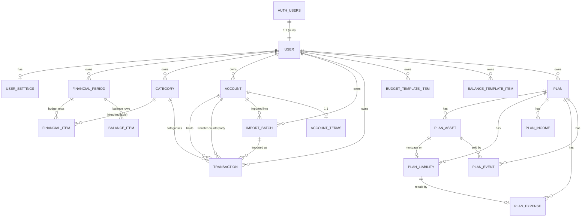

# Data Models

**`prisma/schema.prisma` is the source of truth for columns.** It carries the
comments explaining the non-obvious ones, and it cannot drift from the database.
This document covers what the schema can't say for itself: what each table is
*for*, how ownership flows, and where the auth boundary sits.

> Columns were listed here until 2026-08-10 and had already fallen behind the
> schema in several places, so they were removed rather than repaired. If you
> want to know a table's shape, read the schema.

## Auth boundary

Supabase Auth owns identity, in the Postgres `auth` schema (managed by Supabase,
not by our migrations). The end-to-end sequences are in
[features/auth.md](../features/auth.md); the decision is
[ADR-002](../ADRs/ADR-002-SecurityArchitecture.md).

- `auth.users` is authoritative for email, password, verification state, MFA and
  OAuth identities. **The app never writes to it** — everything goes through
  Supabase Auth APIs via `@supabase/ssr`.
- `public.User` is our profile row, keyed 1:1 to `auth.users(id)`. Domain data
  only.
- **Email addresses are not stored in our tables.** Read them from the session,
  or from `auth.admin` when a job needs one. The monthly reminder does the
  latter; that is not a precedent for copying them.

Consequently there is no `VerificationToken` or `PasswordResetToken` table, and
no password or lockout columns on `User` — Supabase owns all of it. Note that
the `Account` model *is* in the schema but is unrelated to auth: it is a user's
**bank account**.

## The tables

Every table below is owned by exactly one user, directly via `userId` or through
a parent. Most carry `deletedAt` for soft deletion.

> **This file is not current.** It still describes `Account` as
> transactions-only ("where money sits") after the account-registry
> restructure widened its role — see
> [features/accounts.md](../features/accounts.md#known-gaps) for what actually
> changed and why rewriting this file is its own task rather than a rider on
> someone else's. `AccountTerms` below is added because it's new since that
> gap was last written down, not because the rest of this section has been
> brought current.

### Budget and balance

| Table | What it's for |
|---|---|
| `User` | profile row; the owner every other table hangs off |
| `UserSettings` | per-user preferences and feature flags, created lazily on first read |
| `FinancialPeriod` | one month (or week/quarter/year), the shared spine for `/budget` and `/balance` — both hang off the same period row. Unique per `(userId, granularity, startDate)` |
| `BudgetItem` | a budget row in a period: income or expense, budgeted vs actual |
| `BalanceItem` | a balance-sheet row in a period: asset or liability |
| `BudgetTemplateItem`, `BalanceTemplateItem` | a saved "★ Template" set to copy into any month |

### Transactions

| Table | What it's for |
|---|---|
| `Category` | the stable taxonomy a transaction is filed under, and what a `BudgetItem` links to. See [features/onboarding.md](../features/onboarding.md) for what a new account starts with |
| `Account` | where money sits — current, savings, ISA, SIPP. Named as a transfer counterparty too |
| `AccountTerms` | 1:1 with `Account` (its `accountId` is the primary key) — the projection parameters that account feeds into the Plan: expected return, fees, interest rate, a mortgage's revision terms, a final-salary entitlement. Every column is nullable and blank means "take the default," never "unknown" |
| `ImportBatch` | one CSV import, so it can be reversed as a unit |
| `Transaction` | an imported or manual line: date, signed amount, description, optional category and counterparty account |

`BudgetItem.categoryId` is nullable on purpose: a free-typed budget row has no
category, and `label` stays the fallback either way.

### Plan

The forecasting feature (`src/lib/plan/`). A `Plan` is per user; everything else
is per plan and cascades from it.

| Table | What it's for |
|---|---|
| `Plan` | the user's projection: date of birth, retirement age, assumptions |
| `PlanAsset` | a pot or property, with a tax wrapper that drives withdrawal tax |
| `PlanLiability` | a debt; optionally linked to the `PlanAsset` it is secured on (a mortgage) |
| `PlanIncome`, `PlanExpense` | recurring flows. An expense may be the repayment leg of a liability |
| `PlanEvent` | a one-off at an age — a lump sum, or the sale of a linked property |

Those three optional links (mortgage → property, repayment → liability, sale →
property) are what make a mortgage behave as one thing across three tables. They
are `SetNull` on delete, so removing a property leaves its debt rather than
silently deleting it.

A new plan is seeded from the user's most recent period — see
`src/lib/plan/seed.ts`, and the warning about the starter month in
[features/onboarding.md](../features/onboarding.md).

## Ownership and access

**Application-level `userId` filtering is the authorization boundary.**
Server-side Prisma connects with a role that bypasses RLS, so every query must
filter by the signed-in user. RLS policies exist on every table as
defence-in-depth, limiting rows to `userId = auth.uid()` (period- and
plan-scoped tables resolve ownership through their parent) — they become the
real fence only if a future feature queries Supabase from the client. When you
add a user-owned model, write both. See
[features/row-level-security.md](../features/row-level-security.md) and
[ADR-002](../ADRs/ADR-002-SecurityArchitecture.md).

> **Why the schema looks like this.** An earlier draft had a hierarchical
> `FinancialDocument`/`FinancialItem` tree with `parentId`, plus an audit-log
> table. The hierarchy was never built; the shipped design is flat and
> period-based. The flat row it did ship kept the name `FinancialItem` until
> August 2026, when it became `BudgetItem` — so a `FinancialItem` in an old
> commit is that flat row, not the abandoned tree above. An
> earlier version also assumed NextAuth + bcrypt, which
> [ADR-002](../ADRs/ADR-002-SecurityArchitecture.md) replaced with Supabase Auth.
