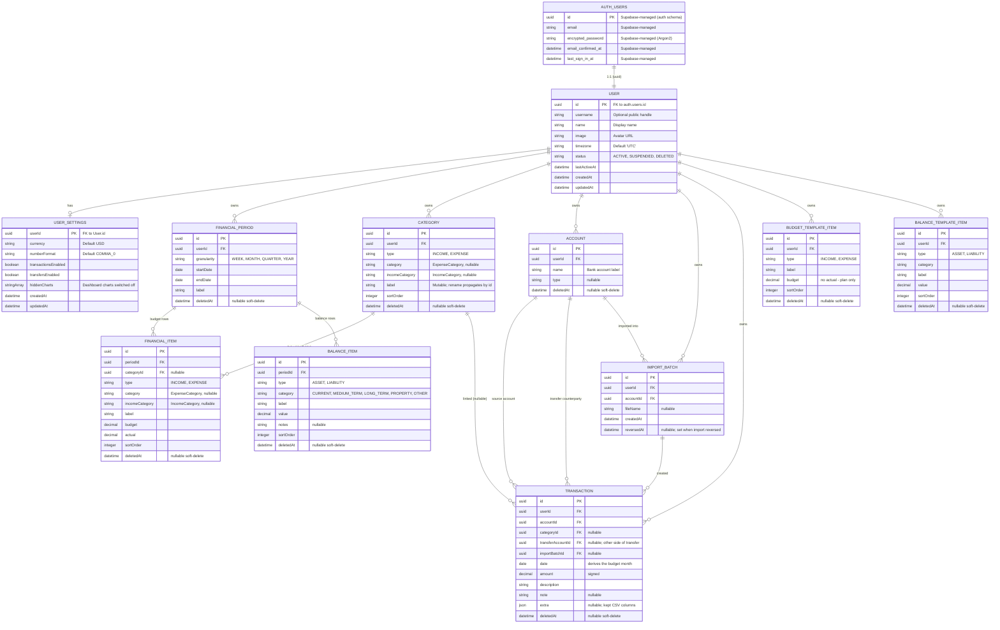

# Data Models

This document describes the data models for the application, and the relationships between them.

It has been really helpful to plan this in advance of coding the project. It will make it quicker to write code, and i have confidence it will lead to less debugging and refactoring later.

> **Revision history**
>
> - 2026-06-10 — Rewritten to match the **implemented** schema (`prisma/schema.prisma`). The earlier draft described a hierarchical `Financial Document` / `Financial Item` design with a `parentId` tree and an `Audit Log` table; none of that was built. The shipped model is a flat, period-based budget/balance schema plus a transactions subsystem (11 models in total).
> - 2026-05-22 — Reworked for the move to Supabase Auth (see [ADR-002](../ADRs/ADR-002-SecurityArchitecture.md)). The original design assumed NextAuth.js + bcrypt and included `Account`, `VerificationToken`, and `PasswordResetToken` tables, plus auth-specific columns on `User` (`password`, `failedLoginAttempts`, `accountLockedAt`, `passwordChangedAt`). Supabase's `auth.users` now owns those, so the application schema only holds profile and domain data keyed to `auth.users(id)`.

## Auth boundary

> The end-to-end sequence (sign-up, sign-in, sign-out, authenticated request) is documented in [docs/features/auth.md](../features/auth.md) with Mermaid diagrams.

Supabase Auth lives in the Postgres `auth` schema (managed by Supabase, not in our migrations). Relevant facts:

- `auth.users(id uuid PK)` — Supabase's authoritative user row. Holds email, encrypted password (Argon2), email confirmation state, last sign-in, MFA factors, OAuth identities.
- We never write to `auth.users` from the app — sign-up, sign-in, password reset, email verification, OAuth callbacks all go through Supabase Auth APIs (via `@supabase/ssr`).
- The application's own user row is `public.User`, keyed to `auth.users(id)` via a `uuid` FK. Anything domain-specific (profile, preferences, soft-delete, app-level audit) lives there.

This means several tables from the original design no longer exist in our schema:

- ❌ `Account` (NextAuth's per-provider OAuth row) — Supabase tracks OAuth identities in `auth.identities`. (The schema *does* have an `Account` model today, but it is unrelated — it represents a user's **bank account** for transactions; see §9.)
- ❌ `VerificationToken` — Supabase handles email verification tokens internally.
- ❌ `PasswordResetToken` — Supabase handles password reset tokens internally.

## Tables (application schema)

### 1. User

A profile row keyed 1:1 to `auth.users`. Holds the domain data that's ours, not Supabase's.

- `id` (PK, uuid) — equals `auth.users.id` (FK)
- `username` — optional public handle
- `name` — display name (mirrored from Supabase user metadata; convenience for queries/joins)
- `image` — avatar URL (mirrored from Supabase user metadata)
- `timezone` — e.g. `"Europe/London"`, default `"UTC"`
- `status` — `ACTIVE | SUSPENDED | DELETED` (application-level status; independent of Supabase's `banned_until`)
- `lastActiveAt` — last time the user interacted with the app (drives auto-logout / "active" badging)
- `createdAt`, `updatedAt`

Notes:

- Password, failed-login counters, account-lock state, password-change-at — all **gone**; Supabase Auth owns them.
- `email` is intentionally not duplicated here; read it from the Supabase session or `auth.users` via a view if needed for joins.

### 2. UserSettings

Per-user app preferences, keyed 1:1 to `User`. Lazily upserted on first read — there is no guaranteed row for every user.

- `userId` (PK, FK → User.id)
- `currency` — display currency, default `"GBP"`
- `numberFormat` — number-format preset, default `"COMMA_0"`
- `transactionsEnabled` — feature flag for the Transactions feature (default on)
- `transfersEnabled` — feature flag for the Transfers section (default on)
- `hiddenCharts` — `string[]` of dashboard chart keys the user has switched off (empty = all shown)
- `createdAt`, `updatedAt`

### 3. FinancialPeriod

A budget / statement period belonging to one user — the shared spine for both `/budget` and `/balance`, so a given month's budget items and balance items hang off the same period row.

- `id` (PK, uuid), `userId` (FK → User.id)
- `granularity` — `WEEK | MONTH | QUARTER | YEAR`, default `MONTH`
- `startDate`, `endDate` (dates), `label`
- `createdAt`, `updatedAt`, `deletedAt` (soft delete)
- Unique on `(userId, granularity, startDate)`

### 4. FinancialItem

A single **budget** line item inside a period. A flat list — no `parentId` tree; items belong to a period and a category bucket.

- `id` (PK), `periodId` (FK → FinancialPeriod)
- `categoryId` (FK → Category, nullable) — links to the stable Category when set; `label` stays the source of truth when unlinked
- `type` — `INCOME | EXPENSE`
- `category` — `ExpenseCategory` (`FIXED | VARIABLE | DISCRETIONARY`), only on expense items
- `incomeCategory` — `IncomeCategory` (`SALARY | SIDE_INCOME | INVESTMENTS | PENSIONS | OTHER`), only on income items
- `label`, `budget` & `actual` (Decimal 12,2), `sortOrder`
- `createdAt`, `updatedAt`, `deletedAt`

### 5. BalanceItem

A **balance-sheet** line item, also belonging to a `FinancialPeriod` (so `/budget` and `/balance` for a month share the period). Flat — the category buckets replace hierarchy.

- `id` (PK), `periodId` (FK)
- `type` — `ASSET | LIABILITY`
- `category` — `BalanceItemCategory` (`CURRENT | MEDIUM_TERM | LONG_TERM | PROPERTY | OTHER`)
- `label`, `value` (Decimal 14,2), `notes` (free-form)
- `sortOrder`, `createdAt`, `updatedAt`, `deletedAt`

### 6. BudgetTemplateItem & 7. BalanceTemplateItem

Reusable template rows owned directly by a user (not tied to a period). "Save this month as template" snapshots a month into these; "Copy from → Template" seeds a new month from them.

- **BudgetTemplateItem** — like FinancialItem but with **no `actual`** (a template is the plan, not spending): `userId`, `type`, `category`/`incomeCategory`, `label`, `budget`, `sortOrder`, timestamps, `deletedAt`.
- **BalanceTemplateItem** — like BalanceItem: `userId`, `type`, `category`, `label`, `value`, `notes`, `sortOrder`, timestamps, `deletedAt`.

### 8. Category

A stable, user-owned spending/earning category — the spine both the budget and transactions hang off. Curated in Settings (rename / merge / archive); a rename touches one row and propagates by id.

- `id` (PK), `userId` (FK)
- `type` — `INCOME | EXPENSE`; `category`/`incomeCategory` bucket mirrors FinancialItem
- `label` (mutable), `sortOrder`
- `createdAt`, `updatedAt`, `deletedAt`

### 9. Account

A user's **bank account** a statement was imported from (unrelated to NextAuth's OAuth `Account`). Picked or created at import time; managed in Settings. Lightweight by design — no per-account balances in v1, just a label to scope/filter transactions and dedup.

- `id` (PK), `userId` (FK)
- `name`, `type` (nullable)
- `createdAt`, `updatedAt`, `deletedAt`

### 10. ImportBatch

One CSV import run. Groups the transactions it created so the whole import can be reversed — the batch's live transactions are soft-deleted and the batch is stamped `reversedAt`.

- `id` (PK), `userId` (FK), `accountId` (FK)
- `fileName` (nullable), `createdAt`, `reversedAt` (nullable)

### 11. Transaction

An imported (or hand-entered) bank transaction. `amount` is stored **signed**; the linked Category's type routes income vs expense (see `src/lib/transactions/actual.ts`). No `periodId` — the `date` derives the budget month on the fly.

- `id` (PK), `userId` (FK), `accountId` (FK)
- `categoryId` (FK → Category, nullable) — uncategorized spend is surfaced, never auto-bucketed
- `transferAccountId` (FK → Account, nullable) — the other side of a transfer
- `importBatchId` (FK → ImportBatch, nullable)
- `date`, `amount` (Decimal 14,2), `description`, `note` (nullable)
- `extra` — JSON; extra CSV columns kept at import time, keyed by header label
- `createdAt`, `updatedAt`, `deletedAt`

## Entity Relationship Diagram

## Row Level Security

Every table in the application schema (`User`, `UserSettings`, `FinancialPeriod`, `FinancialItem`, `BalanceItem`, `BudgetTemplateItem`, `BalanceTemplateItem`, `Category`, `Account`, `ImportBatch`, `Transaction`) has RLS enabled with a policy that limits rows to `userId = auth.uid()` (period-scoped tables like `FinancialItem`/`BalanceItem` resolve ownership through their parent `FinancialPeriod`). RLS is defence-in-depth — server-side Prisma queries bypass RLS, so the primary authorization boundary is still application-level `userId` filtering. See [ADR-002](../ADRs/ADR-002-SecurityArchitecture.md).
