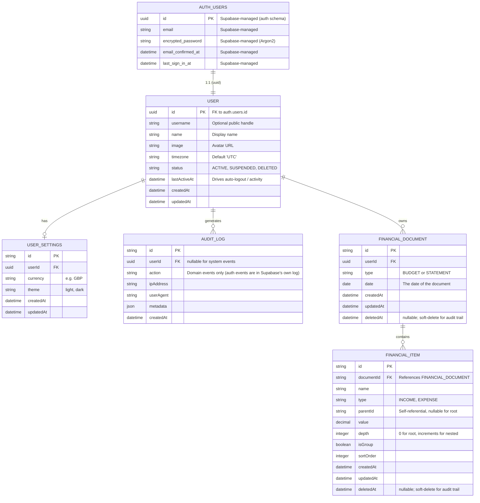

# Data Models

This document describes the data models for the application, and the relationships between them.

It has been really helpful to plan this in advance of coding the project. It will make it quicker to write code, and i have confidence it will lead to less debugging and refactoring later.

> **Revision history**
>
> - 2026-05-22 — Reworked for the move to Supabase Auth (see [ADR-002](../ADRs/ADR-002-SecurityArchitecture.md)). The original design assumed NextAuth.js + bcrypt and included `Account`, `VerificationToken`, and `PasswordResetToken` tables, plus auth-specific columns on `User` (`password`, `failedLoginAttempts`, `accountLockedAt`, `passwordChangedAt`). Supabase's `auth.users` now owns those, so the application schema only holds profile and domain data keyed to `auth.users(id)`.

## Auth boundary

> The end-to-end sequence (sign-up, sign-in, sign-out, authenticated request) is documented in [docs/AuthFlow.md](../AuthFlow.md) with Mermaid diagrams.

Supabase Auth lives in the Postgres `auth` schema (managed by Supabase, not in our migrations). Relevant facts:

- `auth.users(id uuid PK)` — Supabase's authoritative user row. Holds email, encrypted password (Argon2), email confirmation state, last sign-in, MFA factors, OAuth identities.
- We never write to `auth.users` from the app — sign-up, sign-in, password reset, email verification, OAuth callbacks all go through Supabase Auth APIs (via `@supabase/ssr`).
- The application's own user row is `public.User`, keyed to `auth.users(id)` via a `uuid` FK. Anything domain-specific (profile, preferences, soft-delete, app-level audit) lives there.

This means several tables from the original design no longer exist in our schema:

- ❌ `Account` (NextAuth's per-provider OAuth row) — Supabase tracks OAuth identities in `auth.identities`.
- ❌ `VerificationToken` — Supabase handles email verification tokens internally.
- ❌ `PasswordResetToken` — Supabase handles password reset tokens internally.

## Tables (application schema)

### 1. User

A profile row keyed 1:1 to `auth.users`. Holds the domain data that's ours, not Supabase's.

- `id` (PK, uuid) — equals `auth.users.id` (FK)
- `username` — optional public handle
- `name` — display name (mirrored from Supabase user metadata; convenience for queries/joins)
- `image` — avatar URL (mirrored from Supabase user metadata)
- `timezone` — e.g. `"Europe/London"`, default `"UTC"`
- `status` — `ACTIVE | SUSPENDED | DELETED` (application-level status; independent of Supabase's `banned_until`)
- `lastActiveAt` — last time the user interacted with the app (drives auto-logout / "active" badging)
- `createdAt`, `updatedAt`

Notes:

- Password, failed-login counters, account-lock state, password-change-at — all **gone**; Supabase Auth owns them.
- `email` is intentionally not duplicated here; read it from the Supabase session or `auth.users` via a view if needed for joins.

### 2. User Settings

A separate table for details that the user is able to update.

- `userId` (FK → User.id)
- `currency` — the currency the user is using, e.g. GBP, USD
- `theme` — the theme the user is using, e.g. light, dark
- `createdAt`, `updatedAt`

### 3. Audit Log

Application-level audit trail for domain events (e.g., a financial document was deleted, a user changed their timezone). Supabase has its own audit log for auth events (sign-in, password reset, etc.), so this table is *not* duplicating that — it captures things only the app knows about.

- `id` (PK)
- `userId` (FK → User.id, nullable for system-initiated events)
- `action` — domain event type (e.g., `DOCUMENT_DELETED`, `SETTINGS_UPDATED`)
- `ipAddress` — request IP
- `userAgent` — browser/device
- `metadata` — JSON, additional context
- `createdAt`

### 4. Financial Document

A record of the form data that the user enters. It will contain a range of items — income or expenditure — for a given date, for a budget or statement. I like this approach as it is extensible and allows for different types of documents to be created.

I considered creating separate tables for a budget and a statement (or expenditure) table, but that felt like duplication as each contains the same fields and the same relationships with the same items.

### 5. Financial Item

A record of an item in a financial document, e.g. income or expenditure with amount and date.

- `name` — the name of the item
- `type` — `INCOME` or `EXPENSE`
- `parentId` — used to create a hierarchy of items; child items reference their parent
- `depth` — depth in the hierarchy (0 for root, increments for nested)
- `isGroup` — whether the item is a group/parent (controls UI display)
- `sortOrder` — ordering within the same parent
- `value` — the value of the item, used to calculate the document total

## Entity Relationship Diagram

## Row Level Security

Every table in the application schema (`User`, `User_Settings`, `Audit_Log`, `Financial_Document`, `Financial_Item`) has RLS enabled with a policy that limits rows to `userId = auth.uid()`. RLS is defence-in-depth — server-side Prisma queries bypass RLS, so the primary authorization boundary is still application-level `userId` filtering. See [ADR-002](../ADRs/ADR-002-SecurityArchitecture.md).
