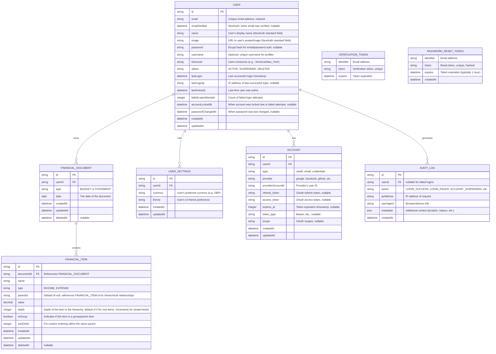

# Data Models

This document describes the data models for the application, and the relationships between them.

It has been really helpful to plan this in advance of coding the project. It will make it quicker to write code, and i have confidence it will lead to less debugging and refactoring later.

## Tables

### 1. User

Pretty standard table containing details about the user, such as status, name, image, email, etc.

#### User Login Flow

When thinking about the required models and relationships, I found it helpful to plan out the login flow so that i would know what fields are needed to access and update.

1. User submits email + password
2. Look up user by email in USER table
3. Verify password against stored bcrypt hash (USER.password field)
4. Check USER.status - reject if SUSPENDED or DELETED
5. On failed password:
6. Increment USER.failedLoginAttempts
7. If attempts exceed threshold (e.g., 5), set USER.status = 'SUSPENDED'
8. Return error and if the user is suspended, inform them to reset their password
9. On successful password match:
9.1. Reset USER.failedLoginAttempts = 0
9.2. Update USER.lastLogin = now()
9.3. Update USER.lastActiveAt = now()
9.4. Generate JWT session token
9.5. Return JWT to client

- lastActiveAt: The last time the user was active or interacted with the app, this is used to determine if the user is still active or not and will assist auto-logout of inactive users.
- failedLoginAttempts: The number of failed login attempts, this is used to determine if the user should be suspended or not.
- lastLogin: The last time the user successfully logged in, this is used to determine if the user should be suspended or not and can assist with security monitoring, e.g. could notify the user when they last logged in and where from. This is nullable as it is only set when the user successfully logs in.
- status: The status of the user, can be ACTIVE, SUSPENDED, DELETED.

### 2. User Settings

A separate table for details that the user is able to update

- currency: The currency the user is using, e.g. GBP, USD, etc.
- theme: The theme the user is using, e.g. light, dark

### 3. Account

Technical details about a users account, with details for authentication providers, access tokens, etc. Session details are going to be handled by JWT.

- type: The type of account, can be "oauth", "email", "credentials"
- provider: The provider of the account, can be "google", "facebook", "github", etc.
- providerAccountId: The provider account id
- refresh_token: The long lived token to refresh the access token for the account.
- access_token: The short lived token from an OAuth provider, i.e. google/facebook, for the users account, this is used to make API calls to the provider to authenticate the user.
- expires_at: The expiration time for the access token
- token_type: The type of token
- scope: The scope of the token

### 4. Verification Token

Separate table, when a user creates an account a verification token will be created and stored here.

Flow for email/password sign-up:

1. User submits email + password on sign-up form
2. VERIFICATION_TOKEN created with identifier: "<user@example.com>"
3. Email sent with verification link
4. User clicks link
5. USER record created (now account exists)
6. ACCOUNT record created (type: "credentials")
7. VERIFICATION_TOKEN deleted

### 5. Password Reset Token

Separate table for password reset tokens. When a user requests a password reset (e.g., after account lockout or forgotten password), a token is created here.

- identifier: The email address of the user requesting the reset
- token: The unique reset token (hashed for security)
- expires: Token expiration timestamp (typically 1 hour from creation)

### 6. Audit Log

Security audit trail for tracking authentication events and suspicious activity. Used for monitoring, incident response, and compliance.

- userId: Foreign key to USER table (nullable for failed login attempts where user doesn't exist)
- action: The type of event (LOGIN_SUCCESS, LOGIN_FAILED, ACCOUNT_SUSPENDED, PASSWORD_RESET, ACCOUNT_CREATED, etc.)
- ipAddress: IP address of the request
- userAgent: Browser/device information
- metadata: JSON field for additional context (e.g., geolocation, failure reason, previous IP)
- createdAt: Timestamp of the event

### 7. Financial Document

A record of the form data that the user enters. It will contain a range of items, they may be income or expenditure, for a given date, for a budget or statement. I like this approach as it is extensible and allows for different types of documents to be created.

I considered creating separate tables for a budget and a statement (or expenditure) table, but that felt like duplication as each contains the same fields and the same relationships with the same items.

### 8. Financial Item

A record of an item in a financial document, e.g. income or expenditure with amount and date.

- name: The name of the item
- type: The type of the item, can be "INCOME" or "EXPENSE"
- parentId: The parent id of the item, this is used to create a hierarchy of items, ie. some items may be grouped together and a child item will want to know which item it belongs to.
- depth: The depth of the item in the hierarchy, this is used to determine the level of the item in the hierarchy, i.e. is it a child or a grandchild?
- isGroup: Whether the item is a group or not, this is used to determine if the item should be displayed as a group in the UI, i.e. if it should be displayed with a different style and is maybe showing the summary of the children.
- sortOrder: The sort order of the item, this is used to determine the order of the items in the UI
- value: The value of the item, this is used to calculate the total value of the document

