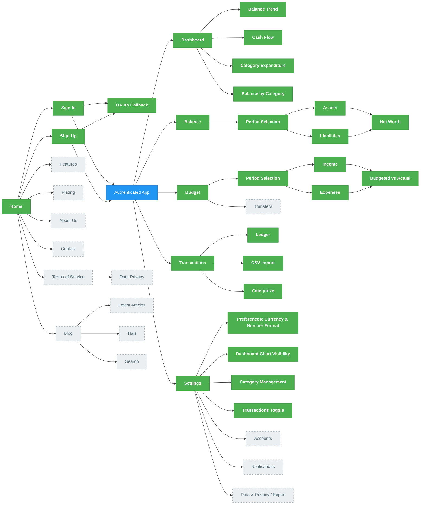

# Halcyon Sitemap

This sitemap maps Halcyon's page hierarchy and navigation. It distinguishes
what is **built today** from what is **planned** so the diagram stays an honest
reflection of the product as it evolves.

- 🟢 **Built** — route exists in `src/app/` and is shipped
- ⬜ **Planned** — designed or intended, not yet implemented (dashed outline)
- 🔵 **Hub** — the authenticated navigation surface (the nav bar)

## Key Pages Description

Legend: 🟢 Built · ⬜ Planned

### Home 🟢

Public landing page with links to sign in / sign up. (Marketing sub-pages below
are planned; the live home page is currently a minimal entry point.)

- ⬜ **Features**: Overview of key product capabilities
- ⬜ **Pricing**: Subscription plans and pricing information
- ⬜ **About Us**: Company information and mission
- ⬜ **Contact**: Contact information

### Sign In / Sign Up 🟢

Public authentication pages backed by Supabase Auth.

- Email/password sign-in and registration
- Google OAuth, completed via the **OAuth Callback** route (`/auth/callback`)
- Unauthenticated access to app pages redirects here (`/sign-in?next=…`)

### Authenticated App 🔵

The logged-in surface, linked together by a persistent nav bar. There is no
`/app` route — this node represents the navigation shell that the pages below
share. Signing in lands the user on the **Dashboard** by default.

### Dashboard 🟢

Authenticated (`/dashboard`); the default post-login page and Halcyon's
reporting/analytics view — a page in its own right (this is what earlier drafts
called "Reports"). Financial overview rendered as charts:

- **Balance Trend**: Balance over time
- **Cash Flow**: Income vs. expenses
- **Category Expenditure**: Spend per category, with budget line
- **Balance by Category**: Asset/liability composition

### Balance 🟢

Authenticated (`/balance`). Asset/liability tracking per period.

- **Period Selection**: View and revise balances for a chosen period
- **Assets**: Bank accounts, investments, property
- **Liabilities**: Debts, loans, obligations
- **Net Worth**: Automatic total assets minus liabilities

### Budget 🟢

Authenticated (`/budget`). A single per-period sheet covering both budgeted and
actual figures (actuals can be sourced from imported transactions when the
Transactions feature is enabled).

- **Period Selection**: Choose the time period
- **Income**: Plan income by source/category
- **Expenses**: Allocate budgeted amounts to spending categories
- **Budgeted vs Actual**: Compare planned figures against actuals
- ⬜ **Transfers**: Net inter-account transfers section, keyed by account pair,
  excluded from income/expense/net-worth (planned — depends on Accounts)

### Transactions 🟢

Authenticated (`/transactions`). Feature-gated by the Settings *Transactions*
toggle.

- **Ledger**: Paginated transaction list
- **CSV Import**: Upload bank statements with preview + duplicate detection
- **Categorize**: Assign categories (and, planned, mark as transfers)

### Settings 🟢

Authenticated (`/settings`); only accessible to logged-in users.

- 🟢 **Preferences**: Currency and number-format selection
- 🟢 **Dashboard Chart Visibility**: Show/hide individual dashboard charts
- 🟢 **Category Management**: Rename, merge, archive spending/earning categories
- 🟢 **Transactions Toggle**: Enable/disable the Transactions feature
- ⬜ **Accounts**: Manage bank accounts and transfer counterparties (planned —
  underpins the Transfers feature)
- ⬜ **Notifications**: Notification preferences (planned)
- ⬜ **Data & Privacy / Export**: Data export and privacy controls (planned)

### Blog ⬜

Publicly accessible blog (planned).

- **Latest Articles**: Most recent posts
- **Tags**: Discover content by topic
- **Search**: Find specific articles

### Terms of Service / Data Privacy ⬜

Public legal pages (planned).
