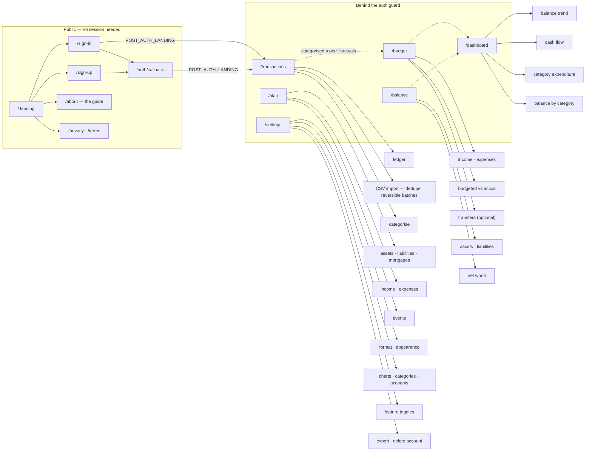

# Sitemap

Every route the app serves, and who can reach it. Generated by reading
`src/app/` and the guard in [`src/lib/supabase/middleware.ts`](../src/lib/supabase/middleware.ts)
— not a plan. If a route is listed here, it exists.



## Route groups

Routes live in two App Router groups. The groups shape nothing in the URL; they
decide which layout wraps the page, and that turns out to matter for
performance:

- **`(marketing)`** — the landing page alone. Its layout reads no session, which
  is what lets the whole group prerender: no auth round-trip in front of the one
  page a stranger judges the product by.
- **`(app)`** — everything that needs to know who is looking. Its layout resolves
  the user, the nav flags and the colour scheme, so it renders per request.

`/auth/callback` sits outside both — it is a route handler, not a page.

## Public

Reachable without a session.

| Route | What it is |
| --- | --- |
| `/` | Landing page. A signed-in visitor is redirected to `/transactions` by the proxy before the page renders, so this is only ever seen signed out. |
| `/sign-in` | Email + password, and "Continue with Google". Accepts `?next=` to return you where you were heading, and `?timeout=idle\|absolute` after a session expiry. |
| `/sign-up` | Account creation. Supabase Auth owns the password and the confirmation email. |
| `/auth/callback` | Route handler. Exchanges the one-time `code` from OAuth, magic links and email confirmation for a session. |
| `/about` | The guide — what the app is for, the monthly rhythm, and what each section does. Deliberately public: it is the honest answer to "what is this?" before signing up. |
| `/privacy` | Privacy notice. |
| `/terms` | Terms of service. |

## Behind the auth guard

Listed in `protectedPaths`. A request without a session is redirected to
`/sign-in?next=<path>`.

| Route | What it is |
| --- | --- |
| `/transactions` | The ledger. CSV import (duplicate detection, reversible batches) and categorisation. Where users land after signing in. Hidden from the nav when the Transactions setting is off. |
| `/budget` | Per-period income and expenses — budgeted against actual, split Fixed / Variable / Discretionary, with an optional transfers panel. |
| `/balance` | Per-period assets and liabilities by horizon (current, medium-term, long-term, property), totalling to net worth. |
| `/dashboard` | Read-only. Balance trend, cash flow, category expenditure and balance-by-category, drawn from the months filled in elsewhere. |
| `/plan` | Long-range forecasting — income, spending, property, mortgages and pensions projected decades ahead. Independent of the month-to-month figures. Hidden from the nav when the Plan setting is off. |
| `/settings` | Currency and number format, colour scheme, chart visibility, categories, accounts, feature toggles, and data export / account deletion. |

## Navigation

The signed-in nav follows how the app is used rather than importance —
import, categorise, budget, balance, then read the result:

```
Transactions → Budget → Balance → Dashboard → Plan → Guide → Settings
```

Transactions and Plan drop out when their settings are off. Guide and Settings
close the row as reference and configuration rather than steps. Signed out, the
bar carries the landing page's section anchors plus Guide.

There is deliberately no "Home" entry: signed-in users are redirected away from
`/`, so it would only ever point at a redirect.

## Not built

- **Blog** — was listed here for a long time as planned. Nothing exists, and
  nothing is scheduled; it is noted only so its absence isn't mistaken for an
  oversight.
