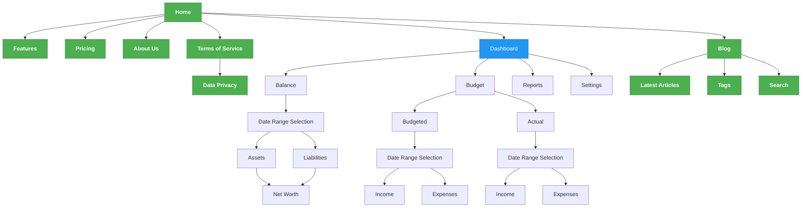

# Halcyon Sitemap

## Key Pages Description

### Home

Landing page with quick access to key features and links to sign up or sign in

- **Features**: Overview of key product capabilities
- **Pricing**: Subscription plans and pricing information
- **About Us**: Company information and mission

### Dashboard

Only accessible to logged-in users

- Central hub with a quick financial overview and quick links to key features

### Balance

Only accessible to logged-in users

- **Date Selection**: Select a specific date to view and revise historical balances
- **Assets**: Track all owned assets including bank accounts, investments, and properties
- **Liabilities**: Monitor all debts, loans, and financial obligations
- **Net Worth**: Automatic calculation of total assets minus liabilities

### Budget

Only accessible to logged-in users

#### Budgeted

- **Date Range Selection**: Select specific time period for actuals
- **Income**: Plan expected income by source/category/subcategory
- **Expenses**: Allocate budgeted amounts to spending categories and subcategories

#### Actual

- **Date Range Selection**: Select specific time period for actuals
- **Income**: Record and view actual income by source/category/subcategory
- **Expenses**: Record and view actual expenses by category/subcategory

### Reports

Only accessible to logged-in users

- Financial reports and analytics from historical data
- Custom report generation

### Blog

Publicly accessible blog page providing articles and insights on financial topics

- **Latest Articles**: Most recent blog posts
- **Tags**: Discover content through related tags and topics
- **Search**: Find specific articles or topics

### Settings

Only accessible to logged-in users, including;

- User preferences
- Account management
- Notification settings
- Data & privacy controls

### Features

Publicly accessible page providing an overview of the different features of the product, including;

- **Dashboard**: Main user interface with financial overview
- **Balance**: Track all owned assets including bank accounts, investments, and properties
- **Budget**: Set and track budgets
- **Reports**: Financial reports and analytics

### Pricing

Publicly accessible page with a comparison of the different subscription plans

### About Us

Publicly accessible page providing company information

### Contact

Publicly accessible page providing contact information

### Terms of Service

Publicly accessible page providing terms of service information

#### Data Privacy

Publicly accessible page providing data privacy information
