# User Journeys

This document should include various user journeys in this application, written in mermaid syntax.

You can preview the diagram in your editor or online, in the repository. I prefer this format over a flowchart written by hand or in another service (such as miro) as it can be edited, I recommend using AI to generate the flowchart and then editing it to your liking.

## Example: User Sign-up

This flowchart is an example of a user journey of the user signing up to the application and completing their first onboarding steps.

```mermaid
flowchart TD
    %% Discovery Phase
    A[Start: Visit Homepage] --> B[View Features]
    B --> C[Read Testimonials]
    C --> D{Decide to Sign Up?}
    D -->|Yes| E[Click Sign Up]
    D -->|No| B

    %% Account Creation
    E --> F[Choose Plan]
    F --> G[Enter Email]
    G --> H[Create Password]
    H --> I[Accept Terms]
    I --> J[Submit Form]
    J --> K[Email Verification]
    K -->|Verified| L[Welcome Screen]

    %% Onboarding
    L --> M[Complete Profile]
    M --> N[Select Preferences]
    N --> O[Take Interactive Tour]
    O --> P[Connect First Integration]

    %% First Value
    P --> Q[View Dashboard]
    Q --> R[Complete Key Action]
    R --> S[Receive Success Feedback]
    S --> T[Explore Advanced Features]

    %% Engagement
    T --> U[Receive Welcome Email]
    U --> V[Follow Up Email]
    V --> W[First Achievement Unlocked]
    W --> X[Prompt for Feedback]

    %% Styling
    classDef userAction fill:#d4f1f9,stroke:#333,stroke-width:2px
    classDef systemAction fill:#d5e8d4,stroke:#333,stroke-width:2px
    classDef decision fill:#fff2cc,stroke:#333,stroke-width:2px

    %% Apply styles
    class A,B,C,E,F,G,H,I,J,M,N,P,Q,R,T,U,V,W,X userAction
    class K,L,O,S systemAction
    class D decision
```

