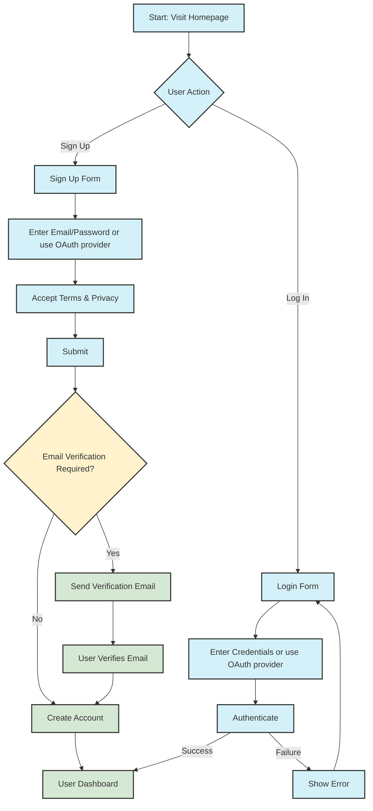

# User Sign-up and Login

This flowchart is an example of a user journey of the user signing up to the application and completing their first onboarding steps.

## Authentication Flow Details

### Sign Up Process

1. User clicks "Sign Up" on the homepage
2. User enters their email and creates a password, or chooses to sign up using an OAuth provider (Google, etc.)
3. User accepts terms and privacy policy
4. System checks if email verification is required (based on authentication method)
   - If using email/password: Verification email is sent
   - If using OAuth (Google, etc.): Verification handled by provider
5. After successful verification/authentication, user is directed to their dashboard

### Login Process

1. User clicks "Log In" on the homepage
2. User enters their credentials, or chooses to log in using an OAuth provider (Google, etc.)
3. System authenticates the user
4. On success: User is directed to their dashboard
5. On failure: Error message is shown and user can try again

### Email Verification

- **Required for**: Email/Password signup
- **Skipped for**: OAuth providers (Google, etc.)
- **Process**:
  1. Verification link sent to user's email
  2. User clicks link to verify
  3. Account is activated and user can log in or is logged in if they are still on the page
