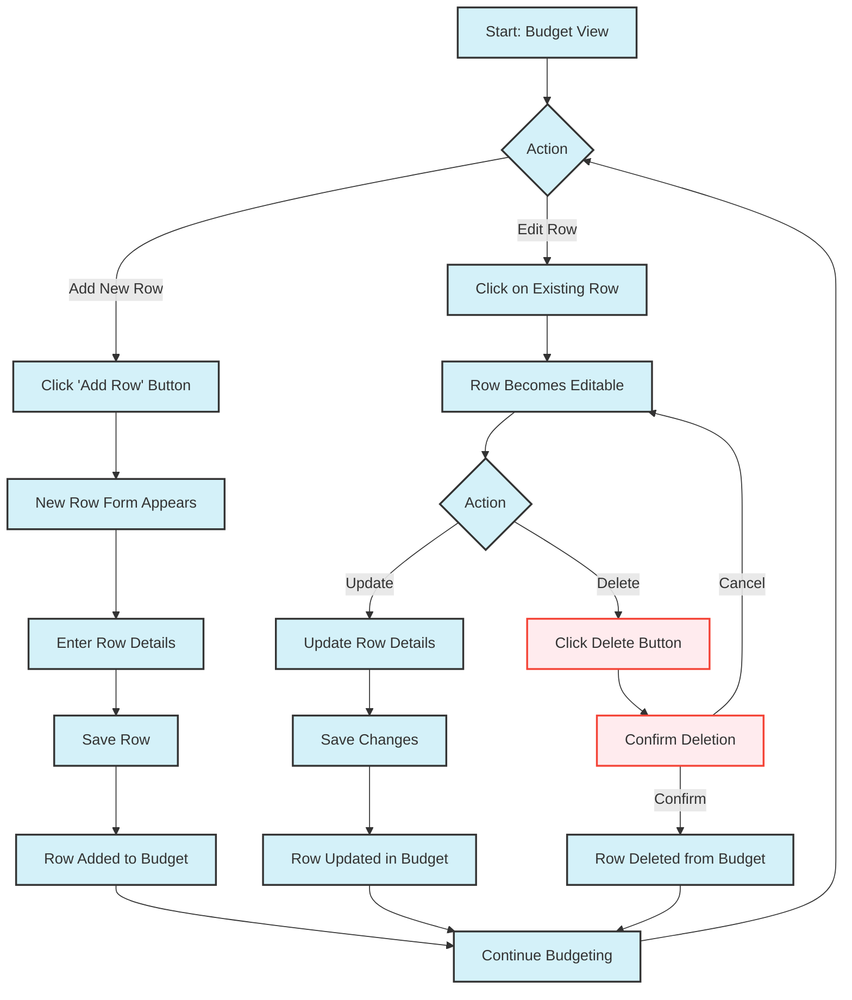

# User Updates a Budget

This flowchart is an example of a user journey of the user updating a budget.

## Budget Row Management Flow

### Adding a New Budget Row

1. From the budget view, user clicks an 'Add Row' button
2. A new row form appears with fields for:
   - Description/Name of the expense/income
   - Amount
   - Category selection
   - Subcategory selection
   - (Optional) Notes or tags
3. User enters the details and clicks 'Save'
4. The new row is added to the budget
5. Budget totals are automatically updated

### Managing Existing Budget Rows

#### Updating a Row

1. User clicks on an existing budget row to edit it
2. The row becomes editable with form controls
3. User can modify:
   - Amount
   - Category / Subcategory
   - Description
   - Any other relevant fields
4. User clicks 'Save' to confirm changes
5. The budget updates to reflect the changes

#### Deleting a Row

1. User clicks on an existing budget row to edit it
2. Clicks the 'Delete' button (trash can icon)
3. A confirmation dialog appears asking to confirm deletion
4. User can either:
   - Confirm: The row is permanently removed
   - Cancel: Returns to edit mode without deleting
5. Budget totals are automatically updated after deletion

### Key Features

- Inline editing for quick updates
- One-click row deletion with confirmation
- Real-time budget calculations
- Category selection with visual indicators
- Responsive design for all devices
