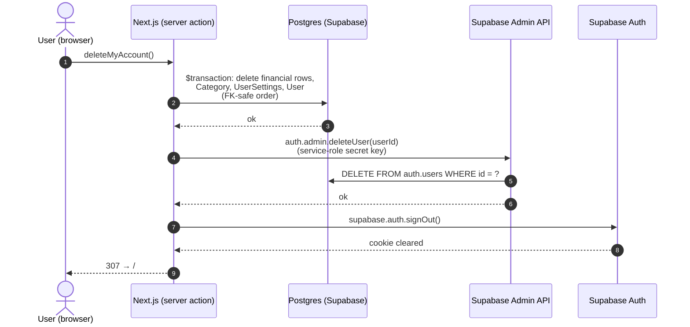

# Privacy & Account-Data Controls Implementation Plan

> **For agentic workers:** REQUIRED SUB-SKILL: Use superpowers:subagent-driven-development (recommended) or superpowers:executing-plans to implement this plan task-by-task. Steps use checkbox (`- [ ]`) syntax for tracking.

**Goal:** Give users GDPR-grade control over their data — export (JSON), clear (financial data only), and hard-delete account (including the Supabase identity) — plus public `/privacy` and `/terms` pages and a site footer.

**Architecture:** Three new server actions in `src/app/settings/dataActions.ts` (kept separate from `accountActions.ts`, which already owns a different `deleteAccount`). A server-only Supabase service-role client (`admin.ts`) performs the `auth.users` erasure. A `DataPrivacy` client component drives the UI from the settings page. Static legal pages render publicly (route protection is an allowlist, so no middleware change is needed). Deletion runs in a single FK-ordered `$transaction`.

**Tech Stack:** Next.js App Router server actions, Prisma, `@supabase/supabase-js` (admin), styled-components, Jest integration tests (real `halcyon_test`), React Testing Library, Playwright.

---

## File Structure

| File | Responsibility |
|---|---|
| `src/lib/data/serialize.ts` | **new** — JSON serializer (Prisma `Decimal`→string; `Date` handled by default `toJSON`) |
| `src/lib/supabase/admin.ts` | **new** — documented service-role client; only used to delete an `auth.users` row |
| `src/app/settings/dataActions.ts` | **new** — `exportMyData`, `clearMyData`, `deleteMyAccount` |
| `src/app/settings/DataPrivacy.tsx` | **new** — "Your data" UI (export / clear / type-to-confirm delete) |
| `src/app/settings/page.tsx` | render `<DataPrivacy />` |
| `src/components/ui/Footer/index.tsx` + `Footer.styled.ts` | **new** — footer with `/privacy` + `/terms` links |
| `src/app/layout.tsx` | render `<Footer />` |
| `src/app/privacy/page.tsx` | **new** — privacy page (placeholder body + factual cookies section) |
| `src/app/terms/page.tsx` | **new** — terms page (placeholder) |
| `docs/AuthFlow.md` | new "Account deletion & data erasure" section + code-map rows |
| `src/__tests__/data/serialize.test.ts` | **new** — serializer unit test |
| `src/__tests__/settings/dataActions.int.test.ts` | **new** — integration tests for the three actions |
| `src/__tests__/settings/DataPrivacy.test.tsx` | **new** — RTL test (controls render, delete gated on `DELETE`) |
| `e2e/legal.spec.ts` | **new** — `/privacy` + `/terms` render signed-out; footer links resolve |

**Branch:** all work lands on `feat/privacy-account-data-controls` (already checked out; the spec is committed there).

---

## Task 1: JSON serializer

**Files:**
- Create: `src/lib/data/serialize.ts`
- Test: `src/__tests__/data/serialize.test.ts`

- [ ] **Step 1: Write the failing test**

```ts
// src/__tests__/data/serialize.test.ts
import { Prisma } from "@prisma/client";
import { serializeExport } from "@/lib/data/serialize";

describe("serializeExport", () => {
  test("renders Prisma Decimal as a string and Date as ISO-8601", () => {
    const json = serializeExport({
      amount: new Prisma.Decimal("12.50"),
      when: new Date("2026-01-02T03:04:05.000Z"),
      nested: { total: new Prisma.Decimal("-7") },
    });
    const parsed = JSON.parse(json);
    expect(parsed.amount).toBe("12.5");
    expect(parsed.when).toBe("2026-01-02T03:04:05.000Z");
    expect(parsed.nested.total).toBe("-7");
  });

  test("produces pretty-printed JSON", () => {
    const json = serializeExport({ a: 1 });
    expect(json).toContain("\n");
  });
});
```

- [ ] **Step 2: Run test to verify it fails**

Run: `pnpm test serialize`
Expected: FAIL — `Cannot find module '@/lib/data/serialize'`.

- [ ] **Step 3: Write the implementation**

```ts
// src/lib/data/serialize.ts
import { Prisma } from "@prisma/client";

// Serialises an export payload to JSON. Prisma `Decimal` instances are rendered
// as strings so monetary precision survives a round-trip (a plain Decimal would
// stringify to `{}`); `Date` values already serialise to ISO-8601 via their
// built-in `toJSON`, so no special handling is needed for them.
export function serializeExport(data: unknown): string {
  return JSON.stringify(
    data,
    (_key, value) =>
      value instanceof Prisma.Decimal ? value.toString() : value,
    2,
  );
}
```

- [ ] **Step 4: Run test to verify it passes**

Run: `pnpm test serialize`
Expected: PASS (2 tests).

- [ ] **Step 5: Commit**

```bash
git add src/lib/data/serialize.ts src/__tests__/data/serialize.test.ts
git commit -m "feat(data): JSON export serializer for Prisma Decimal/Date"
```

---

## Task 2: Supabase service-role admin client

**Files:**
- Create: `src/lib/supabase/admin.ts`

No unit test — it's a thin factory over `@supabase/supabase-js` with no logic; it's exercised (mocked) by the `deleteMyAccount` integration test in Task 5 and checked by `pnpm typecheck`.

- [ ] **Step 1: Write the implementation**

```ts
// src/lib/supabase/admin.ts
import { createClient } from "@supabase/supabase-js";

// Service-role Supabase client. SERVER-ONLY — never import from a client
// component.
//
// Halcyon splits user data across two stores (see docs/AuthFlow.md):
//   • identity → Supabase-managed `auth.users` (email, password hash, OAuth)
//   • profile  → our `public."User"` + the financial tables (Prisma)
//
// The request-scoped client (publishable key, src/lib/supabase/server.ts) is
// bound to the signed-in user and is NOT permitted to delete an `auth.users`
// row. True account erasure (the GDPR right-to-erasure) therefore requires
// Supabase's Admin API, which needs the service-role secret key. That key
// bypasses Postgres RLS, so this module's only caller is the `deleteMyAccount`
// server action.
export function createAdminClient() {
  return createClient(
    // biome-ignore lint/style/noNonNullAssertion: validated at app startup
    process.env.NEXT_PUBLIC_SUPABASE_URL!,
    // biome-ignore lint/style/noNonNullAssertion: server-only secret
    process.env.SUPABASE_SECRET_KEY!,
    { auth: { autoRefreshToken: false, persistSession: false } },
  );
}
```

- [ ] **Step 2: Verify it typechecks**

Run: `pnpm typecheck`
Expected: PASS (no errors).

- [ ] **Step 3: Commit**

```bash
git add src/lib/supabase/admin.ts
git commit -m "feat(supabase): server-only service-role admin client"
```

---

## Task 3: `exportMyData` server action

**Files:**
- Create: `src/app/settings/dataActions.ts`
- Test: `src/__tests__/settings/dataActions.int.test.ts`

The integration harness (`test/integration/setup.ts`) already mocks `@/lib/supabase/server` to return `TEST_USER_ID`, plus `next/cache` and `next/navigation`. `exportMyData` needs nothing more.

- [ ] **Step 1: Write the failing test**

```ts
// src/__tests__/settings/dataActions.int.test.ts
import { exportMyData } from "@/app/settings/dataActions";
import { prisma } from "@/lib/prisma";
import { TEST_USER_ID } from "../../../test/integration/helpers";

// A second user, to prove every action is scoped by userId.
const OTHER_USER_ID = "00000000-0000-0000-0000-0000000000bb";

async function seedFinancialData(userId: string) {
  const account = await prisma.account.create({
    data: { userId, name: "Current" },
  });
  const category = await prisma.category.create({
    data: { userId, type: "EXPENSE", category: "GROCERIES", label: "Food" },
  });
  const period = await prisma.financialPeriod.create({
    data: {
      userId,
      startDate: new Date("2026-03-01"),
      endDate: new Date("2026-03-31"),
      label: "Mar 2026",
    },
  });
  await prisma.financialItem.create({
    data: { periodId: period.id, type: "EXPENSE", label: "Rent", budget: 1000 },
  });
  await prisma.balanceItem.create({
    data: {
      periodId: period.id,
      type: "ASSET",
      category: "CURRENT",
      label: "Cash",
      value: 500,
    },
  });
  await prisma.transaction.create({
    data: {
      userId,
      accountId: account.id,
      categoryId: category.id,
      date: new Date("2026-03-02"),
      amount: -25.5,
      description: "Groceries",
    },
  });
}

describe("exportMyData (integration)", () => {
  test("includes every user-owned table, scoped to the caller", async () => {
    await seedFinancialData(TEST_USER_ID);
    await prisma.user.create({ data: { id: OTHER_USER_ID } });
    await seedFinancialData(OTHER_USER_ID);

    const dump = JSON.parse(await exportMyData());

    expect(dump.user.id).toBe(TEST_USER_ID);
    expect(dump.accounts).toHaveLength(1);
    expect(dump.categories).toHaveLength(1);
    expect(dump.periods).toHaveLength(1);
    expect(dump.financialItems).toHaveLength(1);
    expect(dump.balanceItems).toHaveLength(1);
    expect(dump.transactions).toHaveLength(1);
    // Decimal rendered as string by the serializer.
    expect(dump.transactions[0].amount).toBe("-25.5");
    // None of the other user's rows leaked in.
    expect(dump.accounts.every((a: { userId: string }) => a.userId === TEST_USER_ID)).toBe(true);
  });
});
```

- [ ] **Step 2: Run test to verify it fails**

Run: `pnpm test:int dataActions`
Expected: FAIL — `Cannot find module '@/app/settings/dataActions'`.

- [ ] **Step 3: Write `dataActions.ts` with `requireUserId`, `financialDeletes`, and `exportMyData`**

```ts
// src/app/settings/dataActions.ts
"use server";

import { serializeExport } from "@/lib/data/serialize";
import { prisma } from "@/lib/prisma";
import { createAdminClient } from "@/lib/supabase/admin";
import { createClient } from "@/lib/supabase/server";
import { revalidatePath } from "next/cache";
import { redirect } from "next/navigation";

async function requireUserId(): Promise<string> {
  const supabase = createClient();
  const {
    data: { user },
  } = await supabase.auth.getUser();
  if (!user) redirect("/sign-in?next=/settings");
  return user.id;
}

// Deletes every FINANCIAL row for a user, in FK-safe order. Transactions go
// first because Transaction.transferAccount is onDelete: Restrict — an account
// can't be removed while a transfer still points at it. Does NOT touch User,
// UserSettings, or Category. Returns the ops for a single $transaction.
function financialDeletes(userId: string) {
  return [
    prisma.transaction.deleteMany({ where: { userId } }),
    prisma.financialItem.deleteMany({ where: { period: { userId } } }),
    prisma.balanceItem.deleteMany({ where: { period: { userId } } }),
    prisma.financialPeriod.deleteMany({ where: { userId } }),
    prisma.account.deleteMany({ where: { userId } }),
    prisma.budgetTemplateItem.deleteMany({ where: { userId } }),
    prisma.balanceTemplateItem.deleteMany({ where: { userId } }),
  ];
}

export async function exportMyData(): Promise<string> {
  const userId = await requireUserId();
  const [
    user,
    settings,
    categories,
    accounts,
    periods,
    financialItems,
    balanceItems,
    budgetTemplateItems,
    balanceTemplateItems,
    transactions,
  ] = await Promise.all([
    prisma.user.findUnique({ where: { id: userId } }),
    prisma.userSettings.findUnique({ where: { userId } }),
    prisma.category.findMany({ where: { userId } }),
    prisma.account.findMany({ where: { userId } }),
    prisma.financialPeriod.findMany({ where: { userId } }),
    prisma.financialItem.findMany({ where: { period: { userId } } }),
    prisma.balanceItem.findMany({ where: { period: { userId } } }),
    prisma.budgetTemplateItem.findMany({ where: { userId } }),
    prisma.balanceTemplateItem.findMany({ where: { userId } }),
    prisma.transaction.findMany({ where: { userId } }),
  ]);

  return serializeExport({
    exportedAt: new Date().toISOString(),
    schemaVersion: 1,
    user,
    settings,
    categories,
    accounts,
    periods,
    financialItems,
    balanceItems,
    budgetTemplateItems,
    balanceTemplateItems,
    transactions,
  });
}
```

- [ ] **Step 4: Run test to verify it passes**

Run: `pnpm test:int dataActions`
Expected: PASS (1 test).

- [ ] **Step 5: Commit**

```bash
git add src/app/settings/dataActions.ts src/__tests__/settings/dataActions.int.test.ts
git commit -m "feat(settings): exportMyData server action with scoped JSON dump"
```

---

## Task 4: `clearMyData` server action

**Files:**
- Modify: `src/app/settings/dataActions.ts`
- Test: `src/__tests__/settings/dataActions.int.test.ts` (add a `describe`)

- [ ] **Step 1: Write the failing test**

Append to `src/__tests__/settings/dataActions.int.test.ts` (re-uses `seedFinancialData`, `OTHER_USER_ID` from Task 3):

```ts
import { clearMyData } from "@/app/settings/dataActions";

describe("clearMyData (integration)", () => {
  test("removes financial rows but keeps User, settings, and categories", async () => {
    await seedFinancialData(TEST_USER_ID);
    // seedUser() (global beforeEach) already created UserSettings for TEST_USER_ID.

    await clearMyData();

    expect(await prisma.transaction.count({ where: { userId: TEST_USER_ID } })).toBe(0);
    expect(await prisma.account.count({ where: { userId: TEST_USER_ID } })).toBe(0);
    expect(await prisma.financialPeriod.count({ where: { userId: TEST_USER_ID } })).toBe(0);
    expect(await prisma.financialItem.count({ where: { period: { userId: TEST_USER_ID } } })).toBe(0);
    expect(await prisma.balanceItem.count({ where: { period: { userId: TEST_USER_ID } } })).toBe(0);

    // Kept:
    expect(await prisma.user.findUnique({ where: { id: TEST_USER_ID } })).not.toBeNull();
    expect(await prisma.userSettings.findUnique({ where: { userId: TEST_USER_ID } })).not.toBeNull();
    expect(await prisma.category.count({ where: { userId: TEST_USER_ID } })).toBe(1);
  });

  test("does not touch another user's data", async () => {
    await prisma.user.create({ data: { id: OTHER_USER_ID } });
    await seedFinancialData(OTHER_USER_ID);

    await clearMyData();

    expect(await prisma.transaction.count({ where: { userId: OTHER_USER_ID } })).toBe(1);
    expect(await prisma.account.count({ where: { userId: OTHER_USER_ID } })).toBe(1);
  });
});
```

- [ ] **Step 2: Run test to verify it fails**

Run: `pnpm test:int dataActions`
Expected: FAIL — `clearMyData is not a function` (not yet exported).

- [ ] **Step 3: Add `clearMyData` to `dataActions.ts`**

Append below `exportMyData`:

```ts
export async function clearMyData(): Promise<void> {
  const userId = await requireUserId();
  await prisma.$transaction(financialDeletes(userId));
  revalidatePath("/dashboard");
  revalidatePath("/budget");
  revalidatePath("/balance");
  revalidatePath("/transactions");
  revalidatePath("/settings");
}
```

- [ ] **Step 4: Run test to verify it passes**

Run: `pnpm test:int dataActions`
Expected: PASS (3 tests total in the file).

- [ ] **Step 5: Commit**

```bash
git add src/app/settings/dataActions.ts src/__tests__/settings/dataActions.int.test.ts
git commit -m "feat(settings): clearMyData wipes financial rows, keeps account+settings"
```

---

## Task 5: `deleteMyAccount` server action

**Files:**
- Modify: `src/app/settings/dataActions.ts`
- Test: `src/__tests__/settings/dataActions.int.test.ts` (add a `describe` + file-level mock overrides)

`deleteMyAccount` additionally calls `signOut()` (not on the global server mock), `createAdminClient().auth.admin.deleteUser`, and `redirect("/")`. The test file overrides the two Supabase module mocks (a file-level `jest.mock` wins over the one in `setup.ts` because it is registered when the test module loads, after `setupFilesAfterEnv`). Factory-referenced vars must be prefixed `mock`.

- [ ] **Step 1: Write the failing test**

Add these `jest.mock` calls at the TOP of `src/__tests__/settings/dataActions.int.test.ts` (above the existing imports), then append the new `describe`:

```ts
// --- top of file, before other imports ---
const mockDeleteUser = jest.fn(async () => ({ data: {}, error: null }));

jest.mock("@/lib/supabase/admin", () => ({
  createAdminClient: () => ({ auth: { admin: { deleteUser: mockDeleteUser } } }),
}));

jest.mock("@/lib/supabase/server", () => ({
  createClient: () => ({
    auth: {
      getUser: async () => ({
        data: { user: { id: "00000000-0000-0000-0000-0000000000aa" } },
      }),
      signOut: async () => ({ error: null }),
    },
  }),
}));
```

```ts
// --- appended describe ---
import { deleteMyAccount } from "@/app/settings/dataActions";

describe("deleteMyAccount (integration)", () => {
  beforeEach(() => mockDeleteUser.mockClear());

  test("hard-deletes all rows, calls auth admin deleteUser, then redirects", async () => {
    await seedFinancialData(TEST_USER_ID);

    // redirect("/") is mocked to throw `redirect:/`.
    await expect(deleteMyAccount()).rejects.toThrow("redirect:/");

    expect(mockDeleteUser).toHaveBeenCalledTimes(1);
    expect(mockDeleteUser).toHaveBeenCalledWith(TEST_USER_ID);

    expect(await prisma.user.findUnique({ where: { id: TEST_USER_ID } })).toBeNull();
    expect(await prisma.userSettings.findUnique({ where: { userId: TEST_USER_ID } })).toBeNull();
    expect(await prisma.category.count({ where: { userId: TEST_USER_ID } })).toBe(0);
    expect(await prisma.transaction.count({ where: { userId: TEST_USER_ID } })).toBe(0);
    expect(await prisma.account.count({ where: { userId: TEST_USER_ID } })).toBe(0);
  });

  test("does not touch another user's rows", async () => {
    await prisma.user.create({ data: { id: OTHER_USER_ID } });
    await seedFinancialData(OTHER_USER_ID);

    await expect(deleteMyAccount()).rejects.toThrow("redirect:/");

    expect(await prisma.user.findUnique({ where: { id: OTHER_USER_ID } })).not.toBeNull();
    expect(await prisma.transaction.count({ where: { userId: OTHER_USER_ID } })).toBe(1);
  });
});
```

- [ ] **Step 2: Run test to verify it fails**

Run: `pnpm test:int dataActions`
Expected: FAIL — `deleteMyAccount is not a function`.

- [ ] **Step 3: Add `deleteMyAccount` to `dataActions.ts`**

Append below `clearMyData`:

```ts
export async function deleteMyAccount(): Promise<void> {
  const userId = await requireUserId();

  // App data first, identity second: if the admin call below failed, we'd have
  // erased the financial PII rather than orphaning it behind an undeletable
  // login. Single transaction; user.delete() last so FKs are already cleared.
  await prisma.$transaction([
    ...financialDeletes(userId),
    prisma.category.deleteMany({ where: { userId } }),
    prisma.userSettings.deleteMany({ where: { userId } }),
    prisma.user.delete({ where: { id: userId } }),
  ]);

  // Erase the Supabase identity (email/password/OAuth) — needs the admin client.
  const admin = createAdminClient();
  const { error } = await admin.auth.admin.deleteUser(userId);
  if (error) throw new Error(`Failed to delete auth user: ${error.message}`);

  const supabase = createClient();
  await supabase.auth.signOut();
  redirect("/");
}
```

- [ ] **Step 4: Run test to verify it passes**

Run: `pnpm test:int dataActions`
Expected: PASS (5 tests total in the file).

- [ ] **Step 5: Run the full integration suite to confirm no regressions**

Run: `pnpm test:int`
Expected: PASS (all suites, including the pre-existing `accountActions.int.test.ts` — confirming the file-level mock override didn't leak).

- [ ] **Step 6: Commit**

```bash
git add src/app/settings/dataActions.ts src/__tests__/settings/dataActions.int.test.ts
git commit -m "feat(settings): deleteMyAccount hard-deletes data + Supabase identity"
```

---

## Task 6: `DataPrivacy` UI component

**Files:**
- Create: `src/app/settings/DataPrivacy.tsx`
- Modify: `src/app/settings/page.tsx`
- Test: `src/__tests__/settings/DataPrivacy.test.tsx`

- [ ] **Step 1: Write the failing test**

```tsx
// src/__tests__/settings/DataPrivacy.test.tsx
import { DataPrivacy } from "@/app/settings/DataPrivacy";
import { ThemeProvider } from "styled-components";
import { theme } from "@/lib/theme";
import { fireEvent, render, screen } from "@testing-library/react";

jest.mock("@/app/settings/dataActions", () => ({
  exportMyData: jest.fn(async () => "{}"),
  clearMyData: jest.fn(async () => undefined),
  deleteMyAccount: jest.fn(async () => undefined),
}));

const renderit = () =>
  render(
    <ThemeProvider theme={theme}>
      <DataPrivacy />
    </ThemeProvider>,
  );

describe("DataPrivacy", () => {
  test("renders the three controls", () => {
    renderit();
    expect(screen.getByRole("button", { name: /export my data/i })).toBeInTheDocument();
    expect(screen.getByRole("button", { name: /clear my data/i })).toBeInTheDocument();
    expect(screen.getByRole("button", { name: /delete my account/i })).toBeInTheDocument();
  });

  test("delete button is disabled until the user types DELETE", () => {
    renderit();
    const del = screen.getByRole("button", { name: /delete my account/i });
    expect(del).toBeDisabled();
    fireEvent.change(screen.getByPlaceholderText(/type DELETE/i), {
      target: { value: "DELETE" },
    });
    expect(del).toBeEnabled();
  });
});
```

- [ ] **Step 2: Run test to verify it fails**

Run: `pnpm test DataPrivacy`
Expected: FAIL — `Cannot find module '@/app/settings/DataPrivacy'`.

- [ ] **Step 3: Write the component**

```tsx
// src/app/settings/DataPrivacy.tsx
"use client";

import { Button } from "@/components/ui/Button";
import { useRouter } from "next/navigation";
import { useState, useTransition } from "react";
import styled from "styled-components";
import { SectionHeading } from "./SectionHeading";
import { clearMyData, deleteMyAccount, exportMyData } from "./dataActions";

const Shell = styled.section`
  max-width: 720px;
  margin: 0 auto;
  padding: 0 ${({ theme }) => theme.spacing["2xl"]}
    ${({ theme }) => theme.spacing["5xl"]};
`;

const Lead = styled.p`
  margin: 0 0 ${({ theme }) => theme.spacing.xl};
  font-family: ${({ theme }) => theme.typography.bodyMd.family};
  font-size: 13px;
  color: ${({ theme }) => theme.colors.body};
  max-width: 60ch;
`;

const Group = styled.div`
  display: flex;
  align-items: center;
  gap: ${({ theme }) => theme.spacing.md};
  flex-wrap: wrap;
  padding: ${({ theme }) => theme.spacing.sm} 0;
  border-bottom: 1px solid ${({ theme }) => theme.colors.hairline};
`;

const GroupText = styled.span`
  flex: 1;
  min-width: 200px;
  font-family: ${({ theme }) => theme.typography.bodyMd.family};
  font-size: 13px;
  color: ${({ theme }) => theme.colors.body};
`;

const DangerZone = styled.div`
  margin-top: ${({ theme }) => theme.spacing.xl};
  padding: ${({ theme }) => theme.spacing.lg};
  border: 1px solid ${({ theme }) => theme.colors.negative};
  border-radius: ${({ theme }) => theme.rounded.sm};
  display: flex;
  align-items: center;
  gap: ${({ theme }) => theme.spacing.md};
  flex-wrap: wrap;
`;

const ConfirmInput = styled.input`
  flex: 1;
  min-width: 160px;
  padding: ${({ theme }) => theme.spacing.xs}
    ${({ theme }) => theme.spacing.sm};
  border: 1px solid ${({ theme }) => theme.colors.hairline};
  border-radius: ${({ theme }) => theme.rounded.sm};
  font-family: ${({ theme }) => theme.typography.bodyMd.family};
  font-size: 13px;
`;

const Alert = styled.p`
  color: ${({ theme }) => theme.colors.negative};
  font-size: 13px;
`;

export function DataPrivacy() {
  const router = useRouter();
  const [pending, startTransition] = useTransition();
  const [confirmText, setConfirmText] = useState("");
  const [error, setError] = useState<string | null>(null);

  const onExport = () =>
    startTransition(async () => {
      setError(null);
      try {
        const json = await exportMyData();
        const blob = new Blob([json], { type: "application/json" });
        const url = URL.createObjectURL(blob);
        const a = document.createElement("a");
        a.href = url;
        a.download = `halcyon-export-${new Date().toISOString().slice(0, 10)}.json`;
        a.click();
        URL.revokeObjectURL(url);
      } catch {
        setError("Export failed. Please try again.");
      }
    });

  const onClear = () => {
    if (
      !window.confirm(
        "Delete all your financial records? Your account and settings stay. This cannot be undone.",
      )
    )
      return;
    startTransition(async () => {
      setError(null);
      try {
        await clearMyData();
        router.refresh();
      } catch {
        setError("Couldn't clear your data. Please try again.");
      }
    });
  };

  const onDelete = () =>
    startTransition(async () => {
      setError(null);
      try {
        await deleteMyAccount();
        // On success deleteMyAccount redirects; nothing more to do here.
      } catch {
        setError("Couldn't delete your account. Please try again.");
      }
    });

  return (
    <Shell>
      <SectionHeading>Your data</SectionHeading>
      <Lead>
        Export, clear, or delete the data Halcyon holds about you. Export and
        clear affect only your financial records. Deleting your account is
        permanent and removes everything, including your login.
      </Lead>

      <Group>
        <GroupText>Download everything Halcyon stores about you as JSON.</GroupText>
        <Button type="button" variant="outline" onClick={onExport} disabled={pending}>
          Export my data
        </Button>
      </Group>

      <Group>
        <GroupText>
          Delete all your transactions, accounts, budgets, and balances. Your
          login, settings, and categories stay.
        </GroupText>
        <Button type="button" variant="outline" onClick={onClear} disabled={pending}>
          Clear my data
        </Button>
      </Group>

      <DangerZone>
        <GroupText>
          Permanently delete your account and all associated data. This cannot be
          undone. Type <strong>DELETE</strong> to confirm.
        </GroupText>
        <ConfirmInput
          value={confirmText}
          onChange={(e) => setConfirmText(e.target.value)}
          placeholder="Type DELETE to confirm"
          aria-label="Type DELETE to confirm account deletion"
        />
        <Button
          type="button"
          variant="destructive"
          onClick={onDelete}
          disabled={pending || confirmText !== "DELETE"}
        >
          Delete my account
        </Button>
      </DangerZone>

      {error && <Alert role="alert">{error}</Alert>}
    </Shell>
  );
}
```

- [ ] **Step 4: Run test to verify it passes**

Run: `pnpm test DataPrivacy`
Expected: PASS (2 tests).

- [ ] **Step 5: Render it on the settings page**

In `src/app/settings/page.tsx`, add the import alongside the others:

```ts
import { DataPrivacy } from "./DataPrivacy";
```

and render it last in the returned fragment (after `<AccountManager ... />`):

```tsx
      <AccountManager accounts={managedAccounts} />
      <DataPrivacy />
    </>
```

- [ ] **Step 6: Verify typecheck + lint**

Run: `pnpm typecheck && pnpm lint`
Expected: PASS.

- [ ] **Step 7: Commit**

```bash
git add src/app/settings/DataPrivacy.tsx src/app/settings/page.tsx src/__tests__/settings/DataPrivacy.test.tsx
git commit -m "feat(settings): Your data section — export, clear, delete account"
```

---

## Task 7: Footer with legal links

**Files:**
- Create: `src/components/ui/Footer/index.tsx`, `src/components/ui/Footer/Footer.styled.ts`
- Modify: `src/app/layout.tsx`

Mirrors the `NavBar` directory shape (`index.tsx` + `*.styled.ts`). It's a presentational server component (no test of its own; covered by the E2E in Task 9).

- [ ] **Step 1: Write the styled module**

```ts
// src/components/ui/Footer/Footer.styled.ts
import Link from "next/link";
import styled from "styled-components";

export const FooterBar = styled.footer`
  border-top: 1px solid ${({ theme }) => theme.colors.hairline};
  padding: ${({ theme }) => theme.spacing.lg} ${({ theme }) => theme.spacing["2xl"]};
  display: flex;
  justify-content: center;
  gap: ${({ theme }) => theme.spacing.xl};
  flex-wrap: wrap;
`;

export const FooterLink = styled(Link)`
  font-family: ${({ theme }) => theme.typography.bodyMd.family};
  font-size: 13px;
  color: ${({ theme }) => theme.colors.dim};
  text-decoration: none;

  &:hover {
    color: ${({ theme }) => theme.colors.accent};
  }
`;

export const Copy = styled.span`
  font-family: ${({ theme }) => theme.typography.bodyMd.family};
  font-size: 13px;
  color: ${({ theme }) => theme.colors.dim};
`;
```

- [ ] **Step 2: Write the component**

```tsx
// src/components/ui/Footer/index.tsx
"use client";

import { Copy, FooterBar, FooterLink } from "./Footer.styled";

export function Footer() {
  return (
    <FooterBar>
      <Copy>Halcyon</Copy>
      <FooterLink href="/privacy">Privacy</FooterLink>
      <FooterLink href="/terms">Terms</FooterLink>
    </FooterBar>
  );
}
```

- [ ] **Step 3: Render it in the root layout**

In `src/app/layout.tsx`, add the import:

```ts
import { Footer } from "@/components/ui/Footer";
```

and place it inside the registry, after the page `div`:

```tsx
          <NavBar signedIn={!!user} transactionsEnabled={transactionsEnabled} />
          <div className="min-h-screen">{children}</div>
          <Footer />
        </StyledComponentsRegistry>
```

- [ ] **Step 4: Verify typecheck + lint**

Run: `pnpm typecheck && pnpm lint`
Expected: PASS.

- [ ] **Step 5: Commit**

```bash
git add src/components/ui/Footer/ src/app/layout.tsx
git commit -m "feat(ui): site footer with privacy & terms links"
```

---

## Task 8: Legal pages (`/privacy`, `/terms`)

**Files:**
- Create: `src/app/privacy/page.tsx`, `src/app/terms/page.tsx`

These are static server components. They render publicly because middleware only protects `/dashboard`, `/budget`, `/balance`, `/settings` (see `src/lib/supabase/middleware.ts`) — no change needed there. Body copy is placeholder per the spec; the **cookies** section on `/privacy` is factual.

- [ ] **Step 1: Write the privacy page**

```tsx
// src/app/privacy/page.tsx
export const metadata = { title: "Privacy — Halcyon" };

export default function PrivacyPage() {
  return (
    <main style={{ maxWidth: "60ch", margin: "0 auto", padding: "2rem 1.5rem" }}>
      <h1>Privacy Policy</h1>
      <p>
        <em>
          Placeholder — this policy has not yet been finalised. Replace this copy
          before relying on it. Not legal advice.
        </em>
      </p>

      <h2>What we collect</h2>
      <p>TODO: describe the personal and financial data Halcyon stores.</p>

      <h2>How we use it</h2>
      <p>TODO: describe purposes and lawful basis.</p>

      <h2>Your rights</h2>
      <p>
        You can export, clear, or permanently delete your data at any time from
        Settings → Your data. Account deletion is permanent and removes your
        login and all associated records.
      </p>

      <h2>Cookies</h2>
      <p>
        Halcyon sets a single strictly-necessary cookie — your Supabase
        authentication session (<code>HttpOnly</code>, <code>Secure</code>,
        <code>SameSite=Lax</code>) — which keeps you signed in. We use no
        analytics, tracking, or advertising cookies, and we do not share your
        data for marketing. Because the only cookie is essential to providing the
        service, no cookie-consent banner is required.
      </p>
    </main>
  );
}
```

- [ ] **Step 2: Write the terms page**

```tsx
// src/app/terms/page.tsx
export const metadata = { title: "Terms — Halcyon" };

export default function TermsPage() {
  return (
    <main style={{ maxWidth: "60ch", margin: "0 auto", padding: "2rem 1.5rem" }}>
      <h1>Terms of Service</h1>
      <p>
        <em>
          Placeholder — these terms have not yet been finalised. Replace this
          copy before relying on it. Not legal advice.
        </em>
      </p>

      <h2>Using Halcyon</h2>
      <p>TODO: acceptable use, account responsibilities.</p>

      <h2>No warranty</h2>
      <p>TODO: service provided “as is”, limitation of liability.</p>

      <h2>Changes</h2>
      <p>TODO: how terms may change and how users are notified.</p>
    </main>
  );
}
```

- [ ] **Step 3: Verify pages build and render signed-out**

Run: `pnpm dev` then visit `http://localhost:3000/privacy` and `/terms` in a private window (no session).
Expected: both render without redirecting to `/sign-in`. (Stop the dev server after checking.)

- [ ] **Step 4: Commit**

```bash
git add src/app/privacy/page.tsx src/app/terms/page.tsx
git commit -m "feat(legal): public privacy & terms pages (placeholder + cookie facts)"
```

---

## Task 9: E2E coverage for legal pages + footer

**Files:**
- Create: `e2e/legal.spec.ts`

Mirrors existing Playwright specs (no auth needed — these pages are public). Runs against the dev server on `:3100`.

- [ ] **Step 1: Write the spec**

```ts
// e2e/legal.spec.ts
import { expect, test } from "@playwright/test";

test.describe("legal pages", () => {
  test("privacy page renders signed-out", async ({ page }) => {
    await page.goto("/privacy");
    await expect(page.getByRole("heading", { name: "Privacy Policy" })).toBeVisible();
    await expect(page).toHaveURL(/\/privacy$/); // not redirected to sign-in
  });

  test("terms page renders signed-out", async ({ page }) => {
    await page.goto("/terms");
    await expect(page.getByRole("heading", { name: "Terms of Service" })).toBeVisible();
    await expect(page).toHaveURL(/\/terms$/);
  });

  test("footer links navigate to the legal pages", async ({ page }) => {
    await page.goto("/");
    await page.getByRole("contentinfo").getByRole("link", { name: "Privacy" }).click();
    await expect(page).toHaveURL(/\/privacy$/);
    await page.goBack();
    await page.getByRole("contentinfo").getByRole("link", { name: "Terms" }).click();
    await expect(page).toHaveURL(/\/terms$/);
  });
});
```

- [ ] **Step 2: Run the spec**

Run: `pnpm test:e2e legal` (or `make test-e2e name=legal`)
Expected: PASS (3 tests).

- [ ] **Step 3: Commit**

```bash
git add e2e/legal.spec.ts
git commit -m "test(e2e): legal pages render signed-out and footer links resolve"
```

---

## Task 10: Document account deletion in AuthFlow.md

**Files:**
- Modify: `docs/AuthFlow.md`

- [ ] **Step 1: Add the new section**

Insert a new section **before** the existing `## Known gaps / next iterations`:

````markdown
## Account deletion & data erasure

Halcyon's "identity-in-`auth`, profile-in-`public`" split (see top of this doc) means a user's data lives in two places, so erasure has two halves:

- **App data** — every Prisma row (financial tables, `Category`, `UserSettings`, the `public."User"` profile) is deleted in one `prisma.$transaction`, in FK-safe order. Transactions are deleted before accounts because `Transaction.transferAccount` is `onDelete: Restrict`.
- **Identity** — the `auth.users` record (email, password hash, OAuth identities) is deleted via Supabase's **Admin API** (`auth.admin.deleteUser`). The request-scoped client (publishable key) is not permitted to do this, so a dedicated server-only **service-role client** (`src/lib/supabase/admin.ts`, using `SUPABASE_SECRET_KEY`) performs it. The secret key bypasses RLS and never reaches the browser.

App data is deleted first, then the identity: a failure mid-way leaves the privacy-critical financial data erased rather than orphaned behind an undeletable login.

Two lighter operations live alongside it (both in `src/app/settings/dataActions.ts`):

- **`clearMyData`** — deletes only the financial rows; keeps the login, `UserSettings`, and `Category`.
- **`exportMyData`** — returns a single JSON document of every user-owned row (GDPR data portability); `Decimal` values are serialised as strings.


````

- [ ] **Step 2: Add code-map rows**

In the `## Code map` table, add two rows:

```markdown
| Account-data server actions (export / clear / delete) | [`src/app/settings/dataActions.ts`](../src/app/settings/dataActions.ts) |
| Service-role admin client (account erasure) | [`src/lib/supabase/admin.ts`](../src/lib/supabase/admin.ts) |
```

- [ ] **Step 3: Update the "Known gaps" entry**

Replace the existing bullet:

```markdown
- **No "delete account" flow** — Supabase Admin API supports it (`auth.admin.deleteUser`) but needs `SUPABASE_SECRET_KEY` and a server-only handler.
```

with:

```markdown
- **Password reset UI, MFA, more OAuth providers** — small Supabase dashboard toggles + UI additions. (Delete-account is now implemented — see "Account deletion & data erasure" above.)
```

- [ ] **Step 4: Commit**

```bash
git add docs/AuthFlow.md
git commit -m "docs(auth): document account deletion & data-erasure flow"
```

---

## Final verification

- [ ] **Step 1: Run the full pre-flight**

Run: `pnpm verify` (typecheck + check + unit tests) then `pnpm test:int` then `pnpm test:e2e`
Expected: all green.

- [ ] **Step 2: Manual smoke (optional but recommended)**

With `make build` (local Docker DB) running, sign in and from Settings → Your data: export (file downloads), clear (financial data gone, still logged in), and — on a throwaway account — delete (lands signed-out on `/`, can re-register the same email).

---

## Self-review notes

- **Spec coverage:** export (T1,T3) ✓; admin client + docs (T2,T10) ✓; clear (T4) ✓; hard delete incl. auth.users (T5) ✓; settings UI (T6) ✓; footer (T7) ✓; legal pages + factual cookies (T8) ✓; no cookie banner (T8 copy) ✓; tests incl. cross-user isolation (T3–T6, T9) ✓; AuthFlow docs (T10) ✓. Middleware allowlist: **not needed** (public by default) — corrected from spec.
- **Owner non-code to-dos** (ICO, DPAs, real legal copy) remain deferred — surfaced in the placeholder copy and tracked in memory.
- **Type consistency:** `financialDeletes`, `requireUserId`, `serializeExport`, `createAdminClient`, `exportMyData`/`clearMyData`/`deleteMyAccount`, `DataPrivacy`, `Footer` referenced consistently across tasks.
