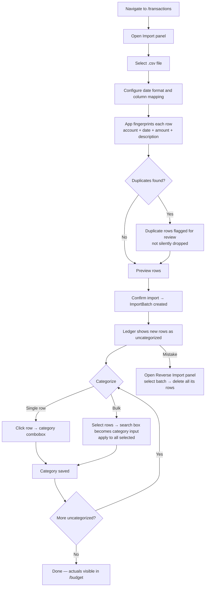

# User Journey: Import Transactions and Categorize

**Journey:** A user uploads a bank statement CSV, reviews what was imported, and categorizes the transactions.  
**Outcome:** Transactions stored, duplicates surfaced, all rows assigned a category.

Requires `transactionsEnabled = true` in UserSettings — the nav link is hidden and the route redirects to `/dashboard` when off.

## Flow

## Steps

### Upload

1. Navigate to `/transactions` → open the Import panel.
2. Choose a `.csv` file (only `.csv` / `text/csv` accepted).
3. Set date format and map columns (date, amount, description) if the parser doesn't auto-detect.

### Deduplication

Each row is fingerprinted: `accountId | YYYY-MM-DD | amountInCents | normalizedDescription`. If a row with the same fingerprint already exists, it is **flagged**, not silently dropped — the user decides whether to import it.

### Review and confirm

After parsing, a preview shows the mapped rows. Confirming creates an `ImportBatch` record (file name, row count) and inserts the `Transaction` rows linked to it.

### Categorize

The ledger shows an uncategorized count badge. Two modes:
- **Single:** click a row's category cell → combobox appears.
- **Bulk:** select rows with checkboxes → the search box becomes a category input; applying sets the category on all selected rows.

Categorized transactions flow into the `/budget` actuals column for their category and period.

### Reverse a batch

If the import was wrong: open the Reverse Import panel, select the batch by file name and date, confirm. All transactions in that batch are deleted. Categories assigned to those rows are also removed.
