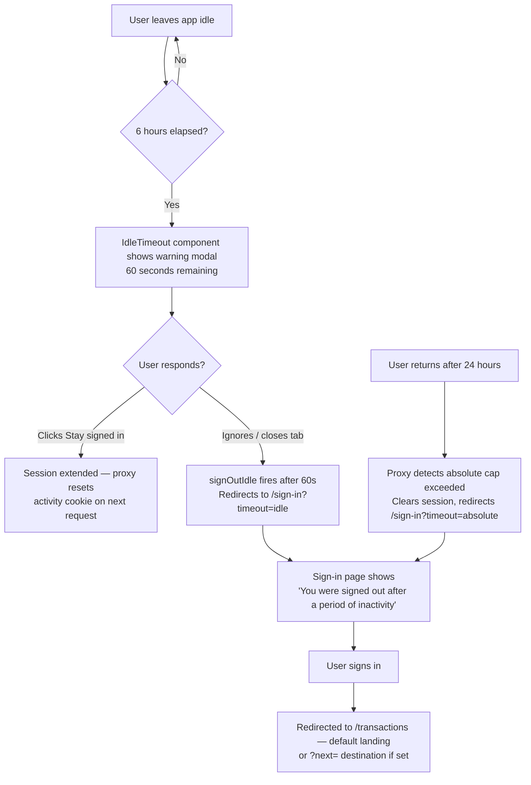

# User Journey: Session Timeout

**Journey:** A user leaves the app idle and returns to find their session has expired.  
**Outcome:** User re-authenticates and lands back at their original destination.

## Timeout limits

| Limit | Value |
|-------|-------|
| Idle timeout | 6 hours of inactivity |
| Absolute cap | 24 hours from sign-in, regardless of activity |
| Warning before expiry | 60 seconds |

Both limits are enforced in two places: the client-side `IdleTimeout` component (warns and signs out gracefully) and the server-side proxy (`src/proxy.ts`) which enforces expiry on every request — including for browsers that were closed without signing out.

## Flow

## Steps

### Warning modal

At 60 seconds before idle expiry, a modal dialog appears over the page with a countdown. The user can click **Stay signed in** — this triggers a page refresh, which passes through the proxy and resets the activity cookie.

### After expiry

If the warning is ignored, `signOutIdle` calls Supabase sign-out and redirects to `/sign-in?timeout=idle`. The sign-in page maps the `timeout` param to a human-readable notice. After signing in, the `?next=` param (if present) restores the user's original destination; otherwise they land at `/transactions`.

### Absolute cap

If 24 hours have elapsed since sign-in — regardless of activity — the proxy enforces expiry on the next request and redirects to `/sign-in?timeout=absolute`. There is no warning for the absolute cap.

### Proxy enforcement

The proxy re-evaluates the `bm_activity` cookie on every request. A session closed by closing the browser is expired by the proxy the moment someone opens the app again — the client-side `IdleTimeout` component is the courteous half, not the enforcing half.
