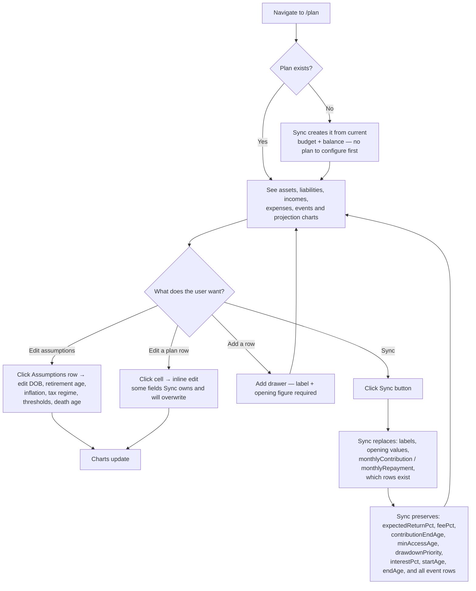

# User Journey: Sync the Plan

**Journey:** A user edits their long-range plan assumptions and row figures, then runs Sync to pull in current budget and balance data.  
**Outcome:** Plan rows reflect the user's live accounts and budget flows; projection charts updated.

See [features/plan-sync.md](../features/plan-sync.md) for what Sync writes and what it preserves.

## Flow

## Steps

### First-time setup

If no plan exists, click **Sync**. Sync reads every `Account` from the latest balance period (as opening values) and every budget `TRANSFER` / `REPAYMENT` row (as monthly flows), and creates the plan. There is nothing to configure before the first Sync.

### Edit assumptions

Click into the Assumptions section. Fields: date of birth, retirement age, plan-to age, inflation %, default return %, return spread %, tax regime (RUK / Scotland), whether thresholds inflate, state pension age + amount, expected death age.

### Edit a plan row

Click any editable cell. **Important:** some fields are owned by Sync and will be overwritten the next time Sync runs:
- Owned by Sync: `label`, `openingValue` (assets/liabilities), `monthlyContribution`, `monthlyRepayment`
- Preserved by Sync: return %, fees, contribution end age, min access age, drawdown priority, interest rate, start/end ages

If you want a custom value on a Sync-owned field to survive, do not run Sync after setting it, or set it after Sync.

### Run Sync

Click **Sync** in the toolbar. Sync is all-or-nothing:
- Rows for accounts/categories that no longer exist are removed.
- Rows for new accounts/categories are added.
- Existing rows are updated on Sync-owned fields only.

Sync reads from the current month's budget and balance — ensure those are up to date before syncing.

### After Sync

The projection charts (net worth over time, income/expense streams, drawdown) update immediately. Use the timeline to inspect individual years.
