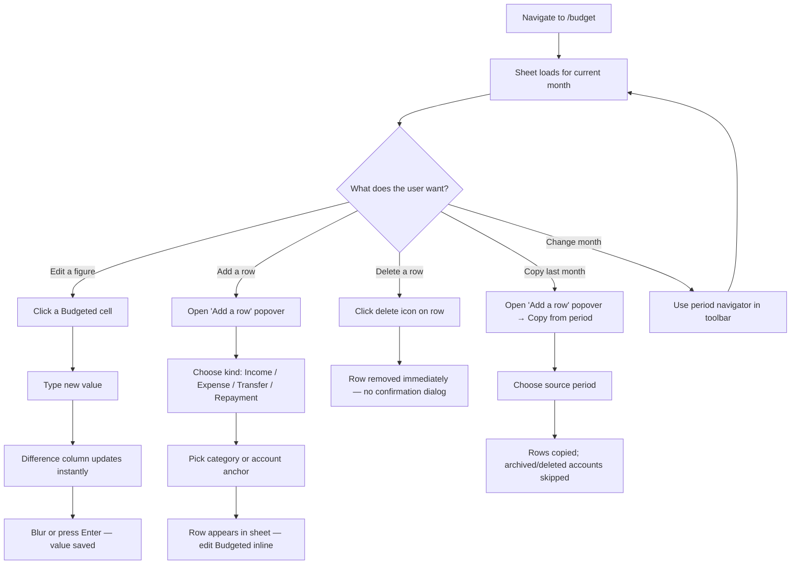

# User Journey: Update a Budget

The budget is an inline spreadsheet grid — there are no pop-up forms. Changes save automatically on blur or via a debounced update as you type. See [features/budget.md](../features/budget.md) for the data model.

## Flow

## Step-by-step

### Editing a value

1. User opens `/budget` — the current month's sheet loads (created automatically if it doesn't exist).
2. Each row shows: **Label** | **Budgeted** | **Spent / Received** | **Difference**.
3. User clicks a **Budgeted** cell. It becomes an editable input.
4. Typing updates the **Difference** column optimistically; the value is debounced-saved per keystroke and committed on blur.
5. Pressing **Enter** moves focus to the same field on the row below. On the last row of an income or expense section, Enter adds a new blank row.

### Adding a row

1. User opens the **"Add a row"** popover (toolbar, top of sheet).
2. Chooses the row kind: Income, Expense, Transfer, or Repayment.
3. Selects the category (Income/Expense) or account anchor (Transfer/Repayment). Accounts already on the sheet are excluded — one row per account per period.
4. The row is inserted into the correct section with a £0 budget. User edits the Budgeted cell inline.

### Deleting a row

1. User clicks the delete icon on any row.
2. The row is removed immediately — there is no confirmation dialog.

### Copying from a previous period

1. User opens the **"Add a row"** popover → "Copy from period".
2. Selects a past period.
3. All rows from that period are copied into the current month. Rows anchored to accounts that have since been archived, deleted, or re-typed are skipped; the sheet reports the count.

### Navigating periods

The toolbar's period navigator moves forward or backward one month. Each month is an independent `FinancialPeriod`; the sheet for a month is created on first visit.

## What the Actuals column shows

The **Spent / Received** column is read-only:
- **INCOME / EXPENSE** rows: sum of transactions categorised to that category in the period.
- **TRANSFER / REPAYMENT** rows: actuals from the transfer/repayment data for that account.

Users cannot edit actuals from the budget page — they come from the Transactions ledger.
