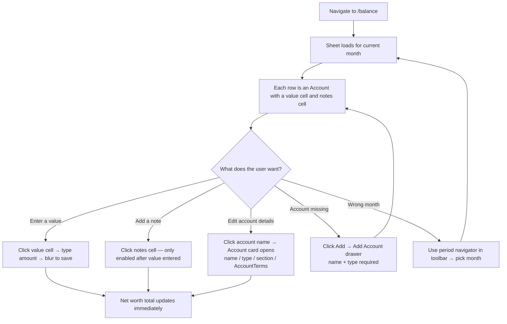

# User Journey: Update Balance Sheet

**Journey:** A user opens the balance sheet and records the current value of each account for the month.  
**Outcome:** All account values entered; net worth updated; Plan Sync can read these as opening figures.

## Flow

## Steps

### Enter a value

Click any value cell, type the current balance, then Tab or click away. The value saves on blur. The net worth total at the bottom of the sheet updates immediately.

### Add a note

Notes describe the figure — a note cell is disabled until the value cell has a number. Click the notes cell, type, blur to save.

### Edit account details

Click the account **name** to open the account card. From there: rename, change type or section, edit AccountTerms projection parameters (expected return, fees, interest rate, etc.). Value and notes stay editable inline on the sheet — the card is for everything else.

### Account missing

Click **Add** in the toolbar. The drawer requires a name and account type; type drives which AccountTerms fields are offered (e.g. mortgages show revision rate and end date, SIPPs show minimum access age). The new account appears in the sheet immediately.

### Past periods

The period navigator shows all existing months. Past period values can still be edited — there is no read-only lock. Editing a past month updates the historical net worth chart on `/dashboard`.
